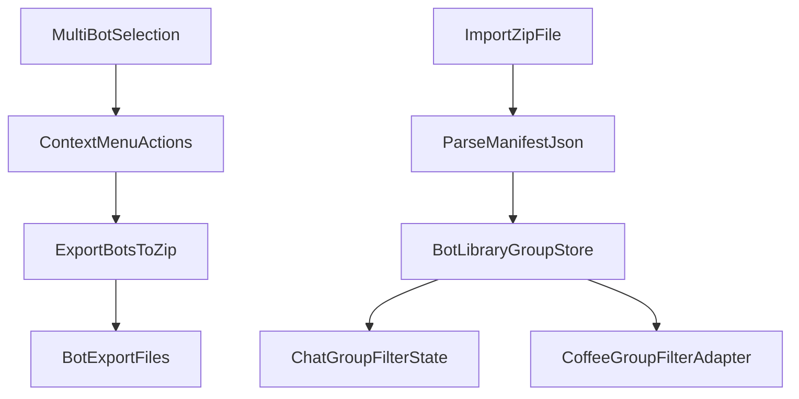

# Bot Groups and ZIP Workflow Master Plan

## Confirmed Product Decisions
- Group size for v1: no hard cap.
- ZIP processing: in the web app (browser-side).
- Dependency: add one lightweight ZIP library for robust packaging/parsing.
- Duplicate handling on ZIP import: partial import with per-duplicate user decision (overwrite or skip), then show a summary.
- Domain boundary: Bot Groups and Coffee Groups remain separate models.

## Target Areas
- Main UI state and context menus: [apps/web/src/app/page.tsx](apps/web/src/app/page.tsx)
- Main UI styling: [apps/web/src/app/page.module.css](apps/web/src/app/page.module.css)
- Shared contracts and exported types: [packages/shared/src/index.ts](packages/shared/src/index.ts), [packages/shared/src/botProfile.ts](packages/shared/src/botProfile.ts)
- API bot hash behavior to preserve compatibility: [apps/api/src/bots.ts](apps/api/src/bots.ts)

## Architecture Flow

## Phase 1: Multi-Select Context Menu Expansion
- Extend context menu branching so when multiple bots are selected, only two entries render:
  - `Export bots`
  - `Group` or `Ungroup` (context-aware based on current group membership state).
- Keep existing single-bot context menu behavior unchanged.
- Ensure right-click behavior works when selection was created by marquee and when selected via click patterns.

## Phase 2: Batch Export to ZIP
- Add a batch export function that serializes selected bots as individual `.bot` payloads and bundles them into a ZIP.
- Preserve existing single `.bot` schema compatibility for each entry.
- File naming strategy:
  - ZIP filename includes date/time and selection count.
  - Internal `.bot` entries use safe slug-based names with collision suffixing.

## Phase 3: ZIP Import Pipeline (Bots + Optional Manifest)
- Add `.zip` acceptance in import UI path (while preserving existing `.bot` import).
- Parse ZIP contents in browser; ingest all `.bot` files.
- If `manifest.json` is present and valid, create/import Bot Group metadata from it.
- Duplicate detection:
  - For each duplicate bot, present overwrite/skip choice.
  - Continue partial import for non-duplicates.
  - Present final summary with counts (imported, overwritten, skipped, failed).

## Phase 4: Bot Group Skeleton + Favorites Invariant
- Introduce a bot-library group model (separate from Coffee model naming and state).
- Add built-in `Favorites` group with invariants:
  - Always present.
  - Not deletable.
  - Empty-by-default grayscale styling.
  - Gradient derived from included bots as members are added.
- Add minimal group CRUD skeleton needed by Group/Ungroup action and import-manifest mapping.

## Phase 5: Group Filter UX in Standard Chat
- Add new group dropdown in the left chat panel.
- Implement two screen states:
  - Default: current PRISM overview; all bots/chats visible.
  - Filtered to group: group overview card (title, description, mini gallery, conversation chips, palette derived from group members), plus filtered bots/chats.
- Keep default behavior stable when no group filter is active.

## Phase 6: Coffee Mode Group Filter Parity
- Add group filter support to Coffee Mode using an adapter layer that consumes Bot Group selection but does not reuse Coffee Group domain state.
- Preserve Coffee session flows and ensure no regressions in existing Coffee controls.

## Verification Gates
- Gate A (after Phase 1): context menu visibility matrix (single-select vs multi-select).
- Gate B (after Phase 2): ZIP export round-trip sanity with multiple selected bots.
- Gate C (after Phase 3): duplicate handling flow validation (overwrite/skip branches + summary).
- Gate D (after Phase 4): Favorites invariants and styling behavior when empty vs populated.
- Gate E (after Phase 5): default vs filtered UI state correctness and chat/bot filtering parity.
- Gate F (after Phase 6): Coffee Mode parity and domain-isolation regression checks.

## Scope Guardrails
- Do not merge Bot Group persistence with existing Coffee Group persistence.
- Do not refactor the full `page.tsx` monolith in this pass; keep incremental edits.
- Do not alter existing single `.bot` import/export contracts in a breaking way.
- Defer advanced group management UX (bulk edit, nested groups, permissions) beyond this delivery.
