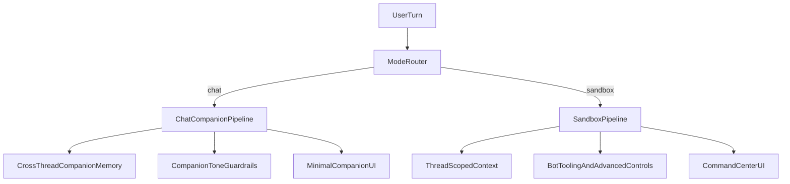

# Chat 2.0 Companion Redesign Plan

## Outcome

Transform `Chat` into a single-companion, low-control personal timeline while preserving `Sandbox` as the full experimentation surface.

## Product decisions locked

- `Chat` identity: companion timeline.
- Companion model: single persistent companion.
- Controls in Chat: minimal (no provider/model/bot switches in Chat UI).
- Rollout: direct replace (no long-lived dual-Chat maintenance).

## Current anchor points in code

- Shared mode contract in [packages/shared/src/index.ts](packages/shared/src/index.ts) (`ChatMode`, `ChatRequestPayload`, and mode comments).
- Chat API flow in [apps/api/src/chat.ts](apps/api/src/chat.ts).
- Sandbox thread-compaction behavior in [apps/api/src/memory-summarizer.ts](apps/api/src/memory-summarizer.ts).
- Main mode UI in [apps/web/src/app/page.tsx](apps/web/src/app/page.tsx) and styling in [apps/web/src/app/page.module.css](apps/web/src/app/page.module.css).
- Product docs in [README.md](README.md) and [DESIGN.md](DESIGN.md).

## Architecture direction

## Implementation plan

### 1) Define explicit mode contracts and invariants

- Tighten shared types in [packages/shared/src/index.ts](packages/shared/src/index.ts):
  - Keep `ChatMode` enum shape, but codify Chat invariants in comments/types (single companion, minimal controls).
  - Add a dedicated Chat-mode settings shape if needed for companion-only preferences (for example, tone/ritual preferences) while keeping Sandbox settings separate.
- Ensure API payload semantics clearly state that advanced runtime knobs are ignored in Chat mode.

### 2) Refactor API routing into two clear pipelines

- In [apps/api/src/chat.ts](apps/api/src/chat.ts), separate Chat and Sandbox request handling behind explicit branches or helper modules:
  - `handleCompanionChatTurn(...)`
  - `handleSandboxTurn(...)`
- Chat branch responsibilities:
  - enforce single companion persona;
  - apply cross-thread companion memory retrieval;
  - prevent advanced overrides from altering the companion contract.
- Sandbox branch responsibilities:
  - keep thread-scoped behavior and advanced controls;
  - preserve current lab-style flexibility.

### 3) Rebuild Chat UI as companion-first surface

- In [apps/web/src/app/page.tsx](apps/web/src/app/page.tsx):
  - remove Chat-side provider/model/bot control affordances;
  - introduce companion-first elements (single identity header, continuity cues, lightweight ritual prompts);
  - keep Sandbox UI as the command center.
- In [apps/web/src/app/page.module.css](apps/web/src/app/page.module.css):
  - establish distinct visual language for Chat (calmer, less dashboard-like);
  - keep Sandbox visual density tuned for tools and experimentation.

### 4) Preserve and sharpen memory boundary behavior

- Keep Chat using cross-thread personal memory.
- Keep Sandbox memory thread-scoped with rolling compaction in [apps/api/src/memory-summarizer.ts](apps/api/src/memory-summarizer.ts).
- Add defensive guards so no Sandbox-only compaction artifacts leak into Chat continuity and no Chat personal memory leaks into Sandbox threads.

### 5) Direct-replace rollout and migration safety

- Directly replace current Chat UI/behavior since there are no external users.
- Add a one-time migration path for existing personal conversations if any shape assumptions changed (retain history, remap metadata as needed).
- Keep fallback logging for the first iteration to quickly detect mode-mixing regressions.

### 6) Documentation alignment

- Update [README.md](README.md) and [DESIGN.md](DESIGN.md) to reflect the new hard mode split.
- Add short “When to use Chat vs Sandbox” guidance with user-visible examples.

### 7) Validation plan

- Manual pass focused on mode separation:
  - Chat: no advanced knobs visible, companion continuity works across conversations.
  - Sandbox: advanced controls/tools remain available and thread-scoped.
  - Boundary: no memory/control leakage between modes.
- If gameplay-critical logic is touched in this repo context, run the quick suite before commit; otherwise validate with targeted mode regression checks.

