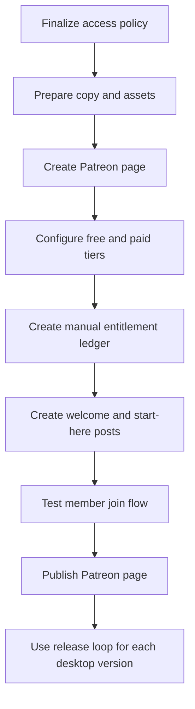

# Prism Patreon Launch Plan

## Goal

Set up Patreon for Prism as a subscription access lane: active patrons receive current Prism Desktop releases, and canceled patrons permanently keep the latest version released during their active membership.

This plan follows the existing model in [docs/distribution-model.md](docs/distribution-model.md), [docs/prism-client-app.md](docs/prism-client-app.md), [docs/release-process.md](docs/release-process.md), and [docs/licensing-and-brand.md](docs/licensing-and-brand.md).

## Recommended Defaults

- Patreon page name: `Prism`
- Free tier: enabled for public updates and community visibility
- Paid tier: `Prism Supporter` at `$10/month`
- Fulfillment at launch: Patreon DM first, email backup, with a unique license code and download link
- Enforcement posture: honest-user friendly, no aggressive DRM, no claims that automated validation already exists
- Delivery channel: GitHub Releases remains the canonical download source; Patreon provides entitlement and release communication
- Support channel at launch: Patreon DM first, email backup
- Patron ledger: local CSV outside the repo, manually backed up
- Brand voice: calm, private, human, indie-professional
- Marketing boundaries: exclude daily-social platforms such as X/Twitter, TikTok, Facebook, and Instagram from the first advertising plan; allow useful forums only when rules clearly permit self-promotion

## Entitlement Policy

Use this as the core promise everywhere Patreon mentions access:

```text
While your Prism membership is active, you get access to the current Prism Desktop release and any new desktop releases published during your membership.

If you cancel, you keep permanent access to the latest Prism Desktop version that was released while your membership was active. Newer versions published after cancellation require an active membership again.
```

Define these operational rules before publishing:

- Re-subscribing restores access to the current release from the new active billing period onward.
- A failed payment gets a 7-day grace window before access is paused.
- A refund or chargeback removes entitlement for releases that were only covered by the refunded payment period.
- Support covers installation, license-code help, and current-version issues for active patrons; canceled patrons get reasonable re-download help for their last entitled version.

## Agentic Operating Protocol

This plan should let agents take the reins where useful while preserving human approval over sensitive or public-facing actions.

### Agent Authority Matrix

Agents may do without asking each time:

- Read Prism docs and current plan files.
- Draft Patreon copy, FAQ text, release-post templates, welcome messages, and outreach drafts.
- Prepare local, repo-safe templates for ledgers, experiment logs, and checklists.
- Research public channels, directories, newsletters, blogs, forums, and their visible posting rules.
- Summarize channel fit and recommend next actions.
- Iterate drafts when blocked by clarity, tone, length, or formatting issues.
- Maintain a plan-local checklist of open blockers and resolved decisions.

Agents may prepare but must ask before final action:

- Any public Patreon page copy, tier description, FAQ, welcome note, or pinned post.
- Any browser form submission that changes pricing, publishes content, creates a tier, or changes creator settings.
- Any cold outreach email, forum post, Reddit post, directory submission, or newsletter pitch.
- Any support message that represents a final policy decision.
- Any repo documentation update that changes public-facing licensing, pricing, support, or entitlement language.

Agents must never do:

- Enter or handle passwords, passkeys, 2FA codes, legal names, tax forms, payout details, or bank details.
- Publish the Patreon page without explicit approval.
- Spend money, start paid ads, buy sponsorships, or enter payment details.
- Change prices, tiers, refund policy, or entitlement policy without approval.
- Impersonate the developer in live comments or direct messages without a reviewed draft.
- Scrape private user data or bypass platform rules.
- Create fake engagement, sockpuppet accounts, spam, or platform-rule evasions.

### Blocker Iteration Ladder

When an agent hits a blocker, it should not stop at the first obstacle unless the blocker involves sensitive access, money, legal/tax information, or a public action.

Default blocker flow:

1. Identify the blocker category.
2. Try one safe alternate route.
3. Try one different format, channel, or wording approach.
4. Record what failed and why.
5. Escalate with a concise recommendation if the blocker still remains.

Retry budget:

- 2 alternate attempts per blocker for copy, research, formatting, channel fit, or documentation issues.
- 0 alternate attempts for passwords, 2FA, tax, payout, legal, paid spend, public publishing, or final brand/taste decisions. Escalate immediately.

Blocker categories:

- Access blocker: login, account lock, 2FA, missing permissions.
- Policy blocker: Patreon or community rules are unclear.
- Money blocker: paid ads, sponsorships, pricing, fees, payout, refunds.
- Brand blocker: tone, visuals, public claims, naming, or creative direction.
- Technical blocker: tracking links, files, release links, browser issues, or automation limits.
- Legal/privacy blocker: tax, terms, data collection, refunds, privacy promises.

### Approval Gates

Before Patreon launch, require approval for:

- Final About page text.
- Final free tier and paid tier text.
- Final permanent-access policy wording.
- Final FAQ.
- Final paid-member welcome note.
- Final pinned `Start Here` post.
- Any public page publish action.

Before post-launch advertising, require approval for:

- The first outreach/ad experiment list.
- Every public post, email pitch, directory submission, or forum/Reddit post.
- Any use of paid ads or sponsorships.
- Any change to positioning, pricing, support promises, privacy promises, or entitlement language.

### Acceptance Criteria

Patreon setup is launch-ready when:

- The Patreon page uses approved Prism copy and assets.
- The free tier clearly offers updates only.
- The paid tier clearly offers Prism Desktop access at `$10/month`.
- The permanent-access policy appears in plain language.
- The 7-day failed-payment grace and refund/chargeback rule are documented.
- The welcome note points paid patrons to the next step.
- The pinned `Start Here` post explains download, license-code delivery, install, and support.
- A local CSV entitlement ledger exists outside the repo and has been tested with one fake patron row.
- The trusted test flow confirms: join, receive instructions, issue code, record ledger row, and confirm last eligible version.
- No public launch, public outreach, or paid spend has happened without approval.

## Setup Flow




## Browser Setup Steps

1. Create or open the Patreon creator page for `Prism`.
2. Set profile image, banner, short tagline, and page description.
3. Enable the free tier for updates only.
4. Create one paid tier: `Prism Supporter` at `$10/month`.
5. Add structured benefits for the paid tier: Prism Desktop access, current releases while active, permanent access to last eligible version, release notes, and basic setup support.
6. Add page FAQ entries for cancellation, re-subscription, refunds, license codes, and what happens if a payment fails.
7. Create a paid-member welcome note with the first-step instructions.
8. Create and pin a patron-only `Start Here` post with download, install, and license-code instructions.
9. Configure payouts, tax information, and creator profile settings.
10. Test the flow with a trusted account before announcing publicly.

## Manual Entitlement Ledger

Before publishing, create a small private spreadsheet or local CSV with these fields:

- Patreon display name
- Patreon email or DM handle
- Membership tier
- Membership start date
- Membership status
- Cancellation date
- Last eligible Prism version
- License code
- Code issued date
- Refund or chargeback status
- Notes

Ledger storage rule:

- The real ledger lives as a local CSV outside the repository and is manually backed up.
- The repository may contain only a schema/template or runbook, never real patron names, emails, license codes, refund notes, or support notes.
- License codes must be unique per patron and recorded before delivery.
- If a code is lost, resend the existing code rather than generating a second active code unless the old code is explicitly marked replaced.

Release-day rule:

- When `desktop/vX.Y.Z` is published, update every currently active paid patron's `Last eligible Prism version` to `X.Y.Z`.

Cancellation rule:

- When a patron cancels, leave their `Last eligible Prism version` frozen at the newest release that shipped during their active membership.

## Content Pack To Draft Before Browser Work

Prepare paste-ready text for:

- Patreon About page
- Free tier description
- Paid tier description
- Paid-member welcome note
- Pinned `Start Here` post
- FAQ section
- Short release-post template
- Cancellation and permanent-access policy
- Support reply templates for license-code delivery, failed payment grace, cancellation, re-subscription, and refund/chargeback cases

## Repo Documentation Follow-Up

After the Patreon setup text is approved, update repo docs only if desired:

- Expand [docs/distribution-model.md](docs/distribution-model.md) with the precise permanent-access policy.
- Expand [docs/release-process.md](docs/release-process.md) so each desktop release includes updating the manual entitlement ledger and posting to Patreon.
- Optionally add a new `docs/patreon-operations.md` runbook for the manual launch process.

No product code changes are needed for the first Patreon launch because [docs/prism-client-app.md](docs/prism-client-app.md) already says real license generation and validation is a follow-up.

## Future Automation Boundary

Do not build Patreon API sync or a license-code server during this setup pass. Treat that as a later plan after the manual process proves demand.

Future automation can include:

- Patreon webhook listener
- License-code generation service
- Entitlement lookup by Patreon account or email
- Self-serve re-download page for each patron's last eligible version
- Automated release entitlement snapshots

## Post-Launch Advertising And Discovery

The launch plan should include advertising without forcing the developer into daily social media posting. Treat advertising as small, measurable discovery experiments rather than a constant public-performance obligation.

Preferred channels:

- Search-friendly Prism landing copy and Patreon page copy.
- Indie app and desktop utility directories.
- Mac, Windows, Linux, local-AI, and privacy-tool communities where self-promotion is explicitly allowed.
- Small newsletters, blogs, and podcasts focused on local AI, indie software, privacy tools, and creative workflows.
- Release-note posts that can be reused across Patreon, GitHub Releases, and the Prism site.
- Select Reddit or forum posts only when the post is useful to the community and allowed by the rules.

Excluded from the first advertising plan:

- Daily posting on X/Twitter, TikTok, Facebook, Instagram, or similar attention-feed platforms.
- Engagement farming, hot takes, trend-chasing, or comment-thread performance work.
- Communities where self-promotion is banned, unclear, or culturally unwelcome.

Agent-assisted work:

- Build outreach lists from public sources.
- Summarize each channel's audience fit and posting rules.
- Draft short ad copy variants, launch blurbs, newsletter pitches, and forum-safe posts.
- Prepare weekly reporting summaries from clicks, Patreon follows, paid conversions, refunds, support burden, and qualitative feedback.
- Maintain an advertising experiment log with channel, message, date, cost, result, and next action.

Boundaries:

- No automated posting without review.
- No fake engagement, sockpuppet accounts, or spam.
- No scraping private user data.
- No platform-rule evasion.
- No paid ads until the Patreon page, fulfillment flow, and support path have survived the first launch test.

First post-launch experiment:

- Run one low-social outreach batch after the Patreon page is live: 5-10 carefully chosen directories/newsletters/blogs/communities, each with a tailored, human-reviewed message and a single tracking note in the experiment log.

Advertising experiment log fields:

- Channel or publication
- URL
- Audience fit
- Posting or submission rules
- Draft message
- Approval status
- Date sent or posted
- Cost
- Result
- Blocker encountered
- Next suggested action

Weekly review loop:

- Summarize all active experiments.
- Identify what produced clicks, follows, paid memberships, replies, refunds, or support burden.
- Recommend the next 3 low-social experiments.
- Ask for approval before any public action.

## Validation Before Launch

Before publishing the Patreon page:

- Confirm the access policy reads clearly and does not over-promise automation.
- Confirm the paid tier says exactly what patrons receive.
- Confirm the manual ledger exists and can track at least one test patron.
- Confirm the welcome note and pinned post explain how to get the app.
- Run one test join flow with a trusted account or preview path if Patreon provides one.

## Plan Monitor Notes

The continuity check found this plan aligned with Prism's current distribution model. The main risks are promising more automation than exists, launching without a manual entitlement ledger, and letting post-launch advertising expand into social-media-heavy or spam-like work.