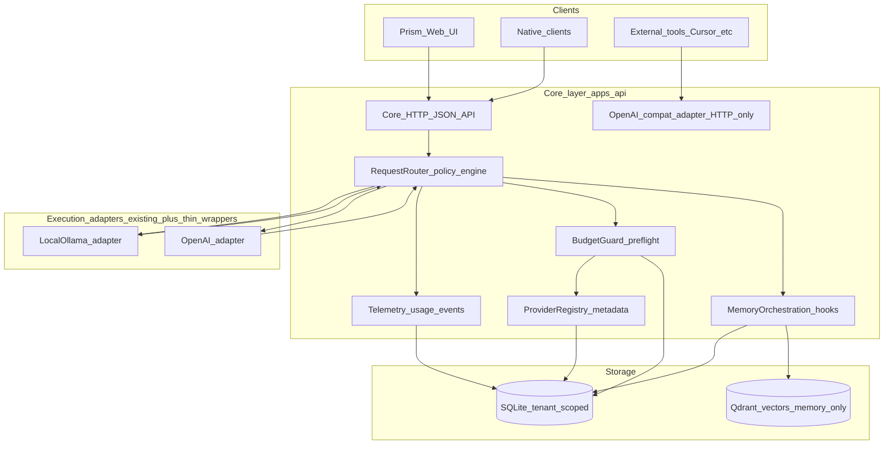

# PRISM Core — Phased Implementation Roadmap

## Grounding in the current codebase

Today, “where intelligence runs” is spread across:

- `[apps/api/src/providers.ts](apps/api/src/providers.ts)` — `selectProvider`, Ollama/OpenAI discovery, chat completion calls, model catalog.
- `[apps/api/src/model-routing.ts](apps/api/src/model-routing.ts)` — auto-model resolution, local-first routing helpers.
- `[apps/api/src/settings.ts](apps/api/src/settings.ts)` + `[apps/api/src/db.ts](apps/api/src/db.ts)` — per-user `preferred_provider`, encrypted OpenAI key material, secondary Ollama host, model preferences.
- `[apps/api/src/server.ts](apps/api/src/server.ts)` — monolithic route table wiring Chat / Sandbox / Coffee paths.
- `[packages/shared/src/index.ts](packages/shared/src/index.ts)` — `ChatMode` and cross-surface types.
- `[apps/web/src/app/page.tsx](apps/web/src/app/page.tsx)` — post-auth Hub tiles and `?view=…` routing (mirrors README/DESIGN intent).

**Core should not rewrite these overnight.** It should **subsume visibility and policy** first, then **optional execution paths** (meta-provider), while keeping Chat/Sandbox/Coffee behavior stable behind the same primitives.

---

## Core Invariants

Non-negotiable truths to prevent drift and preserve PRISM’s identity:

- **Local-first by default** — cloud is opt-in context, not the silent baseline.
- **Cloud escalation is always inspectable** — a user-facing trace or log entry exists whenever execution leaves the local lane.
- **Billing risk is legible** — users always know when a path *may* incur provider cost before it runs (or at the earliest practical gate).
- **Routing decisions are explainable** — structured reason codes and human-readable summaries; no opaque “the system chose.”
- **Graceful offline degradation** — Chat, Sandbox, and Coffee remain usable within honest constraints when local dependencies are down; Core surfaces status instead of brittle failures.
- **OpenAI compatibility is an adapter** — `/v1/*` is an interoperability surface; it translates into Prism primitives and must not become the internal schema spine (see architecture and Phase 5).
- **No hidden autonomous loops** — nothing runs unbounded without explicit user-visible policy and caps.
- **Solo-operable Core** — architecture, ops, and mental model stay small enough for one indie maintainer.
- **Transparency over magic** — prefer explicit settings, previews, and logs over implicit optimization.
- **Stable module UX** — Core evolution must not destabilize Chat’s calm lane, Sandbox’s lab lane, or Coffee’s social lane (`DESIGN.md` separation stays intact).

---

## 1. Proposed backend architecture (target shape)

High-level **logical** architecture (MVP implements a thin slice of this; later phases fill boxes):



### Intent classification (conceptual reserve)

Lightweight **metadata** for routing context and policy evaluation—not an LLM classifier and not a new inference dependency.

- **Sources:** heuristics, inherited `ChatMode` / surface context, optional future structured client hints.
- **Role:** informs policy evaluation alongside explicit user choices; it does **not** replace user or policy authority.
- **Initial category vocabulary (non-exhaustive):** chat, creative, coding, search, memory, agentic, vision.
- **Posture:** ship nothing until a slice needs it; keep the first implementation to mode inheritance + simple tags if ever introduced.

**Internal service boundaries (recommended names, not premature microservices):**


| Boundary                        | Responsibility                                                                                                                                                        |
| ------------------------------- | --------------------------------------------------------------------------------------------------------------------------------------------------------------------- |
| **ProviderRegistry**            | Canonical list of providers + models + capability flags (context window, streaming, tools, vision) merged from Ollama tags + OpenAI catalog rules you already encode. |
| **RoutingPolicyEngine**         | Pure function over inputs: mode, user prefs, model id, health signals, budget state → **decision** + **reason codes** (auditable, no hidden magic).                   |
| **ExecutionRouter**             | Thin orchestration: call existing provider functions, attach streaming callbacks, enforce timeouts.                                                                   |
| **BudgetGuard**                 | Pre-request checks + post-request accounting (tokens/cost estimates); hard-stop vs warn-only modes.                                                                   |
| **TelemetrySink**               | Append structured events (JSON columns or side table); rollups for UI. Where feasible, each routing decision should be **reproducible** from stored inputs + policy version + reason codes (not from opaque in-memory state alone). |
| **OpenAICompatGateway** (later) | **External adapter only:** HTTP surface for `/v1/chat/completions` (and minimal siblings) that **translates** requests/responses to/from Prism’s provider-agnostic execution primitives. Internal types stay Prism-native; avoid mirroring OpenAI’s full object model inside Core. |
| **TaskQueue** (much later)      | Durable job table + worker loop for agentic tasks—explicitly out of early MVP.                                                                                        |


All remain **in-process Node modules** under `apps/api/src/core/` until traffic or packaging forces extraction.

---

## 2. Proposed frontend navigation structure

Align with Prism’s **calm Hub + focused surfaces** pattern (`[README.md](README.md)` tone: low-friction, understandable).

**Hub:** enable a **Core** tile (when feature-ready), same glyph discipline as Sandbox/Chat/Coffee.

**Core shell layout (left rail or top tabs—pick one and stay consistent with existing Settings areas in `page.tsx`):**

1. **Overview** — “What Prism did lately” snapshot: last N routing decisions, current default provider path, health of Ollama hosts, any budget warnings.
2. **Providers** — registry view: models, capabilities, which host (primary vs secondary Ollama), online models; links to existing key management flows (do not duplicate crypto—**surface** what exists).
3. **Routing policies** — rules editor (start with presets: Local-first, Local-only, Allow cloud when…); each rule shows **plain-language explanation** + machine-readable reason codes.
4. **Usage** — time-bucketed charts/tables: requests, est. tokens, est. cost, provider split; export CSV later, not MVP.
5. **Budgets** — per day/week/session caps; “warn at 80%”, “block at 100%”; escalation requires explicit user confirmation in UI the first time.
6. **Request inspector (debug)** — opt-in: last request id, redacted prompts, routing decision JSON; **off by default** for privacy.
7. **API access** (Phase 5+) — token issuance for external clients, endpoint base URL, safety copy (“this exposes your Prism to your LAN/VPN—understand before enabling”).

**UX philosophy guardrails:** transparency without overwhelm—progressive disclosure (Overview → drill down), no surprise toggles that enable billing paths.

---

## 3. Suggested API endpoints (staggered by phase)

**Phase 1–2 (read-mostly, authenticated, tenant-scoped):**

- `GET /api/core/status` — aggregated health: Ollama primary/secondary reachability, OpenAI key *presence* (never value), embedding lane status.
- `GET /api/core/providers` — normalized registry snapshot (from `buildModelCatalog` + user prefs).
- `GET /api/core/routing/preview` — POST body: hypothetical `{ mode, modelId, flags }` → returns **decision + reasons** without executing (dry-run).

**Phase 3–4 (mutations + telemetry):**

- `GET /api/core/routing/policies` / `PUT /api/core/routing/policies` — versioned policy document (JSON) per user.
- `GET /api/core/usage/summary?from=&to=` — rollups.
- `GET /api/core/usage/events?cursor=` — paginated raw events (admin/debug role optional later).

**Phase 5 (external-facing, separate auth story):**

- `POST /v1/chat/completions` (OpenAI-compatible) — behind optional **API key** or **mTLS** for LAN; maps to ExecutionRouter.
- `GET /v1/models` — derived from ProviderRegistry.

**Phase 6+:**

- `POST /api/core/tasks` / `GET /api/core/tasks/:id` — durable agent tasks (queue)—only after telemetry + budgets proven.

**Auth note:** Reuse existing session + client-access patterns from `[apps/api/src/auth.ts](apps/api/src/auth.ts)`; external OpenAI-compat layer likely needs **scoped Prism API tokens** (new table), not user password.

---

## 4. Suggested database / storage responsibilities


| Store                 | Core-related data (incremental)                                                                                                                                                                                                 |
| --------------------- | ------------------------------------------------------------------------------------------------------------------------------------------------------------------------------------------------------------------------------- |
| **SQLite**            | `routing_policies` (JSON blob + version), `usage_events` (append-only), `usage_rollups_daily` (materialized or nightly job), `api_client_tokens` (hashed), optional `routing_decision_samples` ( capped ring buffer per user ). |
| **SQLite (existing)** | Continue storing encrypted OpenAI key in `users` until there is a compelling reason to split—**avoid migration churn early**.                                                                                                   |
| **Qdrant**            | **No** Core billing/telemetry; keep for memory vectors only.                                                                                                                                                                    |
| **Logs**              | Server stdout/file: operational errors only; **never** raw user prompts unless explicit debug mode with retention cap.                                                                                                          |


**Pitfall:** high-frequency per-token writes—use **batching** or aggregate in memory flush every N seconds for MVP.

---

## 5. Suggested file / folder structure (incremental)

```
apps/api/src/core/
  index.ts                 # public factory / register routes helper
  types.ts                 # RoutingDecision, ReasonCode, ProviderRecord
  registry.ts              # wraps buildModelCatalog + host metadata
  policies.ts              # load/save/validate policy JSON
  router.ts                # dry-run + live hook (calls into providers)
  telemetry.ts             # recordEvent, summarize
  budgets.ts               # evaluate + consume budget units
  __tests__/...

packages/shared/src/core/
  routing.ts               # shared reason codes + policy schema types

apps/web/src/app/core/    # optional split from monolith when Core UI grows
  CoreShell.tsx
  sections/...
```

Start by **one** new route file included from `server.ts` to avoid a 2000-line single-file explosion—match existing style.

---

## 6. Libraries / frameworks (conservative)

- **Prefer none new early.** Use existing `fetch`, SQLite driver already in repo, existing crypto patterns from `[apps/api/src/security.ts](apps/api/src/security.ts)`.
- **Optional later:** a small schema validator you already use elsewhere (if none, start with hand-rolled validation + tests—lighter than importing Zod if policy is tiny).
- **OpenAI-compat:** ship as a **thin edge adapter** (minimal chat completions + SSE streaming by hand); translate to Prism primitives; defer full OpenAI SDK server emulation.

---

## 7. Realistic MVP scope (what “done” means for v1 Core)

**Goal:** user can open Core and **trust what Prism is doing** without changing all product behavior.

Deliver **one vertical slice**:

1. **Routing preview (dry-run)** from real settings + model catalog + host health.
2. **Decision log** for **one** execution path first (recommend: Sandbox completion only—highest experimentation value, clearest expectations).
3. **Usage summary** that counts **requests** and rough **token estimates** (from response usage fields when present; estimate otherwise—document uncertainty in UI).

Explicitly **out of MVP:** external `/v1` server, multi-provider beyond current Ollama+OpenAI, agent task queue, automatic cloud escalation without confirmation.

---

## 8. “What makes PRISM unique” (product + engineering)

- **Refraction, not fusion:** one user intent → **visible** decomposition across local/cloud/memory/tools with **reason-coded** routing (auditability beats “smart”).
- **Indie trust contract:** local-first defaults, **anticipatory billing safety**, no dark patterns in provider switches.
- **Modular surfaces:** Core elevates **cross-cutting ops** without collapsing Chat’s emotional minimalism or Sandbox’s lab density (`[DESIGN.md](DESIGN.md)` split is an asset—preserve it).
- **Interoperability path:** Prism as **meta-provider** for external dev tools—meets power users where they already work (Cursor, Continue, Cline) without becoming an IDE.

---

## Phase-by-phase roadmap

### Phase 1 — Foundations

- **Goals:** introduce Core as a **product surface** + stable **concepts** (types, reason codes, empty policy schema) without risky behavior changes.
- **User-facing:** Core tile (or feature-flagged) opens shell with Overview copy + “coming online” sections; no false promises in UI.
- **Backend:** `packages/shared` types for `RoutingDecision`, `ReasonCode`, `CorePolicyV1` (versioned); stub `GET /api/core/status` backed by existing health/model discovery code paths.
- **Frontend:** Core shell route (`?view=core` pattern consistent with Hub), placeholder sections wired to status endpoint.
- **Architecture:** Core as **read-only observer** of existing systems.
- **Risks:** Hub clutter—mitigate with feature flag env var until stable.
- **Do not build yet:** policy enforcement, external API, task queues.

### Phase 2 — Provider abstraction

- **Goals:** single **ProviderRegistry** read model for UI + dry-run router inputs; unify primary/secondary Ollama and OpenAI model entries with **capability metadata** (even if some fields are heuristic at first).
- **User-facing:** Providers page lists “what Prism knows about” with honest labels (“estimated”, “reported by host”).
- **Backend:** `registry.ts` wrapping `[buildModelCatalog](apps/api/src/providers.ts)`; extend types only where needed; tests for deterministic merging.
- **Frontend:** Providers table + detail drawer.
- **Risks:** Ollama model tags lying about capabilities—surface uncertainty; don’t over-promise tool/vision support.
- **Do not build yet:** plug-in provider SDK for arbitrary vendors.

### Phase 3 — Routing engine

- **Goals:** **policy-driven** routing decisions with **transparent logs**; integrate at **one** call site behind a thin `executeWithCoreTrace()` wrapper.
- **User-facing:** Routing policies page with presets + “why this request went local/cloud” timeline.
- **Backend:** `policies.ts` + `router.ts`; persist policy JSON; append `routing_events` on each wrapped completion; preserve current behavior as **default policy = today’s semantics**. Each stored event should include **policy version + reason codes + inputs** needed to reproduce the decision whenever feasible (same reproducibility standard as the **TelemetrySink** row in §1).
- **Frontend:** timeline component + policy editor (start with presets + JSON advanced toggle if needed).
- **Risks:** performance overhead—keep logging **O(1) small JSON**; sampling toggle for high-volume users later.
- **Do not build yet:** multi-model fan-out per user turn, automatic reranking across providers.

### Phase 4 — Usage + budgeting

- **Goals:** **visibility** first, **hard budgets** second; prevent surprise billing via preflight warnings.
- **User-facing:** Usage charts + budget caps + “blocked: would exceed weekly cloud budget” with override flow.
- **Backend:** `telemetry.ts` + `budgets.ts`; store rollups; integrate with Router **before** cloud calls; cost estimates from a **maintained price table** per model id (document as approximate).
- **Frontend:** Usage + Budgets sections; clear copy on estimation error bars.
- **Risks:** inaccurate cost math erodes trust—label estimates, show formulas in help panel.
- **Do not build yet:** team/org billing, invoice reconciliation.

### Phase 5 — OpenAI-compatible API layer

- **Goals:** minimal **chat completions** + **streaming** for external tools; strict auth; default **off**.
- **Architecture:** treat `/v1/*` as a **thin translation layer** at the edge. PRISM’s internal router, registry, budgets, and telemetry remain **provider-agnostic**; the adapter maps OpenAI-shaped JSON to those primitives and maps results back. Do not let OpenAI field names or DTOs become the canonical internal model.
- **User-facing:** API access panel: create/revoke token, show base URL, security warnings.
- **Backend:** new HTTP listener mount or path prefix `/v1` with separate rate limits; map request → `ChatMode` policy default (likely Sandbox-like: no cross-thread memory unless explicitly configured later).
- **Risks:** prompt injection from LAN clients—treat as **trusted network** boundary; document threat model.
- **Do not build yet:** full Assistants API, function-calling parity matrix for all tools.

### Phase 6 — External tool integration

- **Goals:** smooth **Continue/Cursor/Cline** setup: copy-paste base URL + model name mapping; optional **model alias** map (“cursor model id → Prism internal id”).
- **User-facing:** short setup wizards + “test connection” button hitting `/v1/models`.
- **Backend:** alias table + validation; optional CORS tightening.
- **Do not build yet:** marketplace of third-party agents.

### Phase 7 — Agentic task orchestrstration

- **Goals:** durable **task** queue for long-running workflows; **deterministic cancellation** (user or system can always end a task in a defined state); per-task budgets.
- **User-facing:** task list, statuses, failure artifacts.
- **Backend:** SQLite queue + worker with backoff; strict caps on concurrency; **explicit execution ceilings** (max steps, max wall time, max child jobs—initially **zero** self-spawning).
- **Safety posture:** first waves use **human-approved task templates** only—no ad-hoc graph compilation from free text. **No recursive self-spawning task graphs** in early versions.
- **Risks:** runaway automation—ceilings + cancellation + budgets are product requirements, not optional tuning.
- **Do not build yet:** autonomous AGI-style open-ended loops, implicit multi-agent swarms, or marketplace-style orchestration.

### Phase 8 — Future experimental features

- **Examples (illustrative only):** optional memory-routing refinements; carefully bounded “second opinion” local runs—only where Phases 3–4 observability already supports them.
- **Rule:** each experiment behind a **flag** + **telemetry** + **budget** from day one; no new surface ships without the Core Invariants satisfied.

---

## Technical risks and dependencies


| Risk                                          | Mitigation                                                                       |
| --------------------------------------------- | -------------------------------------------------------------------------------- |
| Monolithic `server.ts` becomes unmaintainable | Extract Core routes to `apps/api/src/core/routes.ts` early.                      |
| Telemetry SQLite write pressure               | Batch writes; aggregate; cap retention per user.                                 |
| Security of external `/v1`                    | Separate tokens, loopback-only default, optional reverse proxy guidance in docs. |
| UX overload                                   | Progressive disclosure; sane defaults identical to today’s behavior.             |
| Drift between “preview” and live routing      | Share one policy evaluation function for dry-run and live.                       |


**Dependencies:** stable model id scheme (including `ollama-secondary:` prefix from `[providers.ts](apps/api/src/providers.ts)`); Chat/Sandbox/Coffee guardrails unchanged.

---

## Critique and open gaps (studio second pass)

- **Stakeholder decisions needed later (not blocking roadmap):** whether external API requests inherit **memory** at all in v1; default threat model (LAN-only vs Tailscale vs public HTTPS).
- **Scope creep risk:** building a “mini OpenAI dashboard” inside Prism—resist; ship **decisions + estimates** first.
- **Verification gap until implementation:** manual matrix per phase (≤4 steps) when code lands—e.g. dry-run matches live routing on sample prompts.
- **Documentation:** when Core ships materially, README “Feature status” should move Core from Planned → Implemented with one paragraph—**after** behavior exists, not before.

---

## Explicit anti-goals (reinforced)

- Not a **Cursor-class IDE**.
- Not training a **frontier foundation model**.
- Not **unbounded autonomous** agent loops without caps and user visibility.
- Not **enterprise IAM** early (keep single-user tenancy strong first).
- Not letting **OpenAI request/response shapes** define Prism’s internal architecture—compat stays at the adapter boundary.
- Not microservices, Kubernetes-style distribution, speculative agent swarms, or vendor marketplaces as prerequisites to ship Core.

