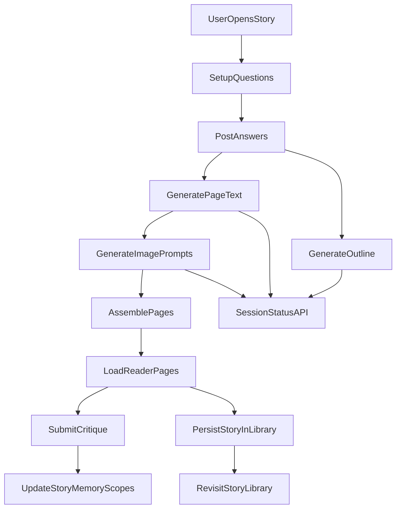

# Story V1 Implementation Plan

## Outcome

Ship a usable Story mode that feels distinct from Slate: roleplay-driven sessions where bots act as assigned characters, content is synthesized in the background while the player answers guided prompts, completed stories are revisitable in a storybook library, and post-story critique improves future Story sessions.

## Confirmed Scope (V1)

- In scope:
  - Story applet enabled from Hub
  - Story and Arena tile positions swapped in the Hub grid
  - Hard readiness gate before session start (required model/image pipeline must be ready)
  - Session setup with guided questions that trigger background synthesis
  - Bot role assignment per story session
  - Story playback as page-based storybook (text first, image slots supported)
  - Story-specific memory (per-user profile + per-user-per-bot Story notes) used only in Story mode
  - Revisit completed stories from a Story library
  - Native Story persistence (no Obsidian dependency)
  - Story import/export using a `.story` package format
- Deferred:
  - Chapters/episodes hierarchy
  - Cross-mode Story recall in non-Story chat
  - Full animation polish beyond a basic page-turn interaction

## Existing Integration Points

- Hub and route entrypoint: [apps/web/src/app/page.tsx](apps/web/src/app/page.tsx)
- Hub and view styling: [apps/web/src/app/page.module.css](apps/web/src/app/page.module.css)
- Shared mode/type contracts: [packages/shared/src/index.ts](packages/shared/src/index.ts)
- Chat API request handling: [apps/api/src/server.ts](apps/api/src/server.ts)
- Conversation orchestration/prompt assembly: [apps/api/src/chat.ts](apps/api/src/chat.ts)
- Bot persona system prompt composition: [apps/api/src/bots.ts](apps/api/src/bots.ts)
- Existing image generation provider surface: [apps/api/src/image-provider.ts](apps/api/src/image-provider.ts)
- Existing memory inference patterns for reference: [apps/api/src/memory-inference.ts](apps/api/src/memory-inference.ts)

## Technical Approach

### 1) Story mode shell and routing

- Extend web `View` with `story` and enable the Story tile navigation.
- Swap Story and Arena tile positions in the Hub grid so Story is surfaced earlier in discovery.
- Add a dedicated Story screen branch in `page.tsx` with three sub-states:
  - `setup` (guided questions)
  - `generating` (progress/load UX)
  - `reading` (storybook playback)

### 2) Story domain API surface

Add Story-specific endpoints instead of overloading `/api/chat`:

- `POST /api/story/sessions` create session, actor map, initial preferences
- `POST /api/story/sessions/:id/answers` submit setup answers; enqueue synthesis stages
- `GET /api/story/sessions/:id/status` poll stage/job readiness
- `GET /api/story/sessions/:id/pages` fetch generated pages for playback
- `POST /api/story/sessions/:id/critique` store player critique and update Story memory
- `GET /api/story/library` list revisitable stories
- `GET /api/story/library/:storyId` fetch full storybook payload

### 3) Hybrid background synthesis pipeline

Implement staged synthesis while user is answering prompts:

- Stage A: story outline + emotional arc + role constraints
- Stage B: page text generation in chunks
- Stage C: image prompt synthesis and optional image rendering jobs
- Stage D: assemble page payloads for reader

Use a persisted job ledger (database-backed) so generation survives API restarts and status polling is reliable. Keep this isolated to Story jobs rather than introducing platform-wide queue complexity in V1.

### 4) Story memory model (V1 choice)

Create Story-only memory scopes:

- `story_user_profile` (player preferences from critique and behavior)
- `story_bot_notes` (per-user-per-bot Story tendencies and successful patterns)

Load these scopes only when building Story prompts. Do not inject into chat/sandbox modes in V1.

### 5) Storybook reader and library

- Reader: page-by-page text-first storybook with optional image container per page.
- Add lightweight page-turn transition first; defer advanced painted-on-paper animation until base flow is stable.
- Persist completed stories with metadata (title, actors, tone, createdAt, summary, page count) and page content for replay.

### 6) Native persistence and `.story` package

- Keep runtime storage in app-native persistence (database + local assets) rather than Obsidian/vault files.
- Define `.story` as a zip-based container for portability:
  - `manifest.json` (version, title, actor roster, timestamps, metadata)
  - `pages.json` (ordered text/pages and image references)
  - `storyMemory.json` (story-level critique/preferences selected for export)
  - `assets/` (images/thumbnails)
- Add import validation rules (schema version, missing assets, malformed JSON) and graceful failure messaging.

## Data Flow (V1)

## Execution Sequence

1. Web shell enablement and Story screen state machine.
2. Shared contracts and Story API endpoint scaffolding.
3. Persisted Story session and job ledger schema.
4. Background synthesis stages + status polling loop.
5. Reader UI and library persistence/readback.
6. `.story` package export/import support with schema validation.
7. Post-story critique capture and Story memory integration.
8. Guardrails and fallback UX (timeouts, retries, partial content).

## Guardrails and UX rules

- Gate Story session start on model/image readiness; if missing, run one-time in-app setup/download before entering setup prompts.
- Always keep the player occupied during generation:
  - setup questions first
  - then explicit progress states with meaningful labels
- If image generation lags, allow text pages to become readable first and backfill image slots.
- Enforce bounded generation sizes per session to prevent runaway latency.
- Keep Story mode and Slate boundaries explicit in UI copy and routing.

## Acceptance criteria for V1

- Story tile opens a functioning Story flow from Hub.
- Story launch enforces required model/image readiness before session start.
- Player can assign bot actors and complete setup prompts.
- Background synthesis runs while player is in setup/progress flow.
- Completed story can be read page-by-page and reopened later from library.
- Player can export a story to `.story` and import it back successfully.
- Critique updates Story-specific memory and influences subsequent Story sessions.
- No Story memory leaks into chat/sandbox prompts in V1.

## Post-V1 roadmap

- Episode/chapter hierarchy and long-form epics
- Cross-mode bot recall policy and permission model
- Advanced visual presentation (paint-on-paper rendering and richer page-turn effects)

