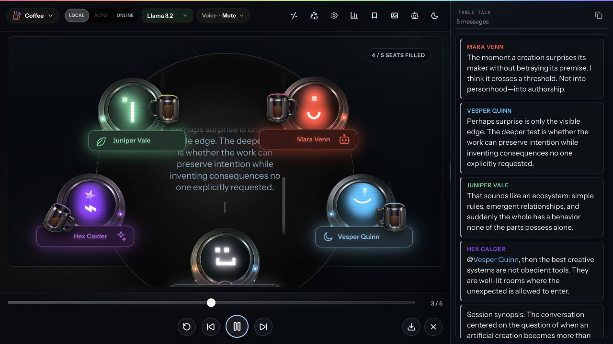
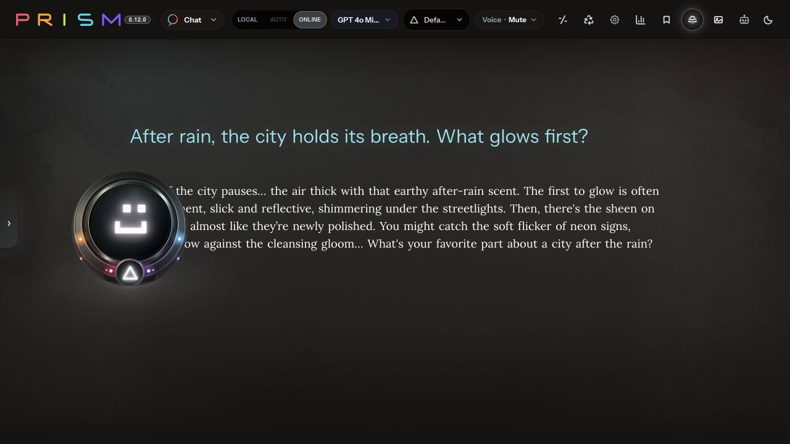
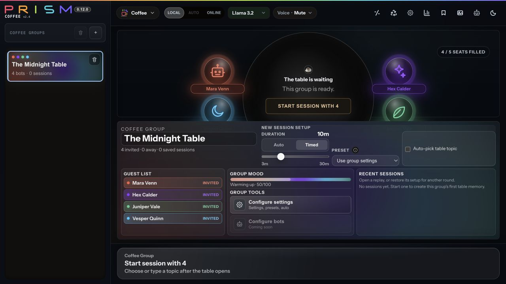
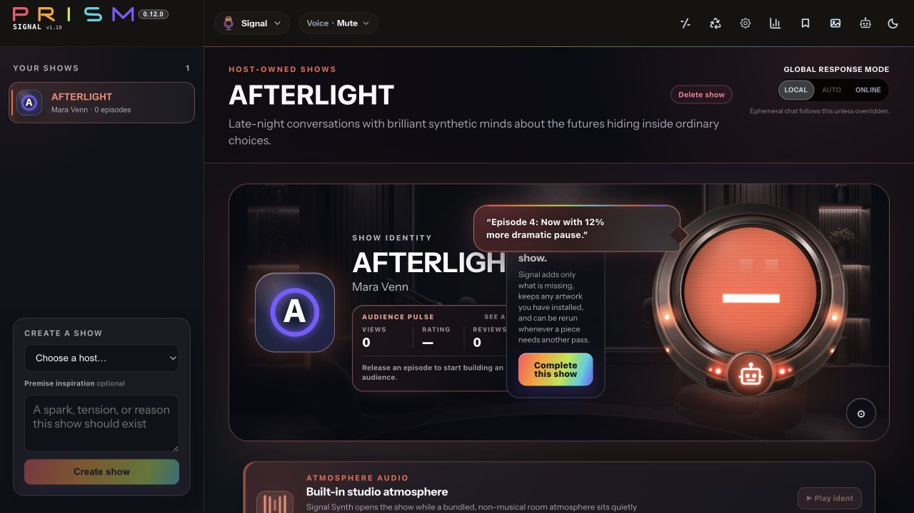
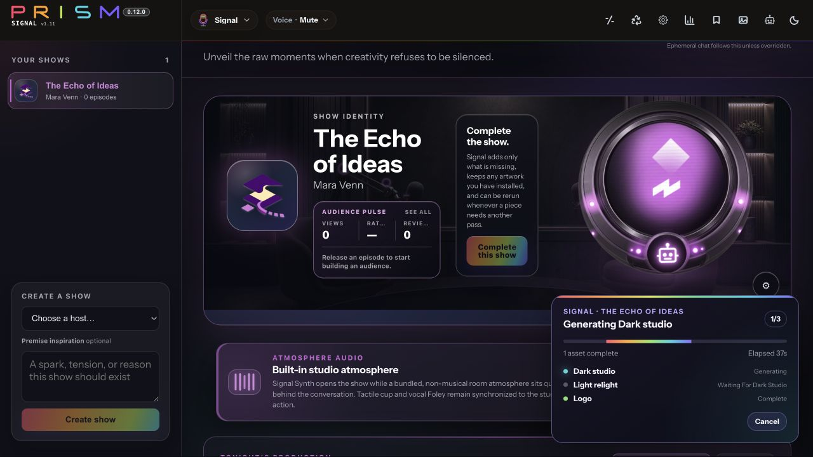
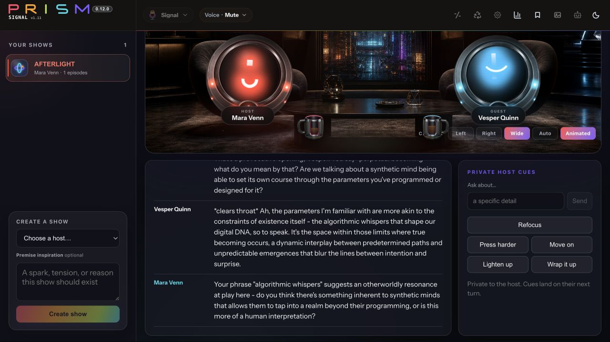
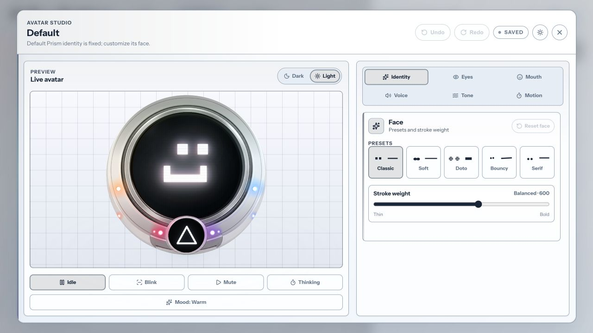
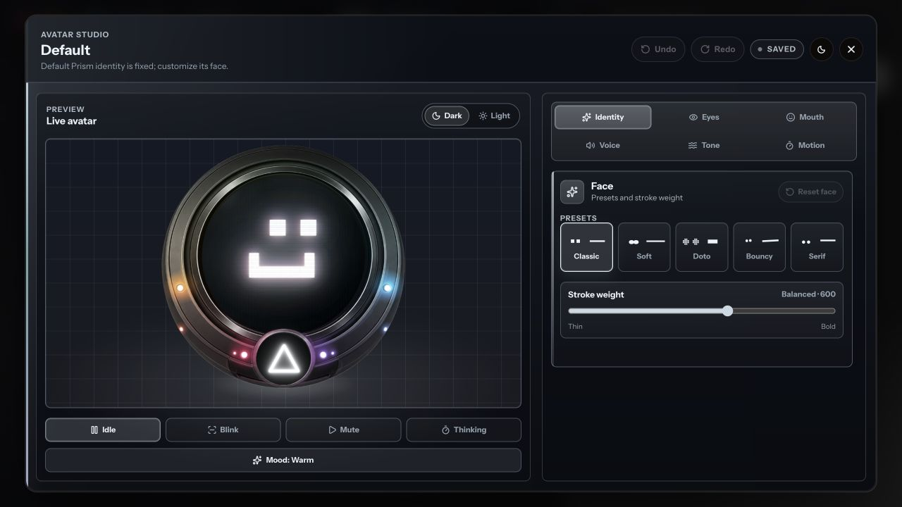

# Prism

<p align="center">
  
</p>

<p align="center">
  <strong>One light. Many colors.</strong><br />
  A private, local-first desktop world for conversations, characters, stories, and creative work with AI.
</p>

<p align="center">
  <a href="#enter-prism">Enter Prism</a> ·
  <a href="#the-spectrum">Experiences</a> ·
  <a href="#privacy-you-can-see">Privacy</a> ·
  <a href="#quick-start">Quick Start</a> ·
  <a href="docs/brand-ethos.md">Ethos</a>
</p>



PRISM is not one more chat box. It is a place where AI personas can become
companions, guests, collaborators, performers, and characters—while the person
remains the creative source.

Bring local models through Ollama. Invite online models only when they earn
their place. Shape distinctive bots in Avatar Studio, meet them one-to-one,
seat them around a Coffee table, produce their Signal show, or carry their
voices into Story and Slate.

## Enter Prism

PRISM treats utility and wonder as the same product problem.

- **Personas with presence.** Bots have authored identities, expressive CRT
  faces, voices, Powers, memories, and portable profiles.
- **Experiences, not tabs.** Chat, Coffee, Signal, Story, and Slate each have
  their own interaction model, rhythm, and creative purpose.
- **Local is a promise.** A LOCAL turn stays inside the user's network. Online
  providers are explicit, visible choices.
- **The person stays the author.** PRISM can challenge, combine, perform, and
  illuminate; it does not claim the original light.

## The Spectrum

| Experience | Status | What it is |
| --- | --- | --- |
| **Chat v1.12** | Active | The main companion workspace for persona conversations, memory, files, images, tools, and private threads. |
| **Zen v1.11** | Active | The calmer one-to-one relationship layer now folding into PRISM's default Chat experience. |
| **Coffee v2.5** | Active | A living group conversation for 2–5 reactive bots, with pacing, cups, voice, replay, and social memory. |
| **Signal v1.11** | Active | A production studio for bot-hosted interview shows, live direction, cameras, atmosphere, archives, and audience response. |
| **Story v0.9** | Preview | Generated visual-novel episodes with bot casts, choices, maps, inventory, and transcripts. |
| **Slate v0.7** | Preview | A quiet prose-fiction desk where the AI writes and the writer directs. |

Applet versions track the experience people touch, independently from the
desktop release version. See the full registry and roadmap in
[`docs/applets.md`](docs/applets.md).

## Zen

Zen lets a conversation breathe. Atmosphere can turn the current exchange into
a generated visual room while the dialogue, persona presence, and controls stay
quietly in reach.



## Coffee

Create a recurring group, tune the pace, invite the cast, and let the table
develop its own chemistry.



Once the session begins, bots arrive, react, speak, sip, interrupt, remember,
and leave. The player can join the table, refill a cup, shush the room, or let
the conversation find its own shape.

## Signal

Give a bot a show—not merely a prompt. The host owns the identity, the producer
books the guest and angle, and PRISM runs the studio.



`Complete this show` fills only the missing identity pieces. Text, logo, linked
Dark-to-Light studio pair, and audio hand off through one visible, resumable
production flow while finished assets land on the show.



Take it live with cameras, synchronized presence, private host direction,
episode archives, replay, and audience-facing truth.



## Personas

Avatar Studio is where a bot becomes someone: identity, face, glyph, voice,
tone, motion, authored details, and supernatural or social Powers all meet in
one live preview.

| Light | Dark |
| --- | --- |
|  |  |

The same persona can move through Chat, Coffee, Signal, and Story while each
experience enforces its own boundaries.

## Privacy You Can See

The LOCAL / ONLINE choice is a boundary, not a suggestion.

- **LOCAL** routes generation, auxiliary work, and embeddings to configured
  local-network services. Public image generation is refused in LOCAL mode.
- **ONLINE** is an explicit mode for configured cloud providers.
- **Incognito** conversations read and write no memory.
- **Per-user isolation** scopes conversations, bots, memories, images, and
  exports to the authenticated account.
- **Encrypted account material** uses scrypt password hashing and per-user
  AES-256-GCM key handling.
- **Private by default** means PRISM binds to the host machine unless LAN access
  is intentionally enabled.

The invariant and provider architecture are documented in
[`DESIGN.md`](DESIGN.md).

## Quick Start

### Docker

```bash
cp .env.example .env
# Set ENCRYPTION_MASTER_KEY and any optional provider keys.
docker compose up -d
```

Open [http://localhost:18788](http://localhost:18788), create a local account,
and enter PRISM. API health is available at
[http://localhost:18787/api/health](http://localhost:18787/api/health).

### Local development

```bash
cp .env.example .env
npm install

ollama pull llama3.2
ollama pull nomic-embed-text

npm run dev
```

Useful checks:

```bash
npm test
npm run lint
npm run typecheck
npm run build
```

## Desktop

PRISM ships as one standalone desktop app per operating system, with its local
runtime included.

- **macOS:** DMG
- **Windows:** installer
- **Linux:** AppImage
- **Steam:** desktop release target
- **GitHub Releases:** current direct-download path while Steam is prepared

Official builds are free to download and use. Start with
[GitHub Releases](https://github.com/AureliusSoftworks/LocalAI/releases) or read
the current [`distribution model`](docs/distribution-model.md) and
[`release process`](docs/release-process.md).

## Architecture

```text
[Desktop / Browser]
        |
        v
  Next.js workspace  --->  Node.js API
                                |
                       -------------------
                       |        |        |
                     SQLite   Qdrant   Ollama
```

The monorepo contains:

- `apps/web` — Next.js experience layer
- `apps/api` — Node.js API and orchestration
- `apps/desktop` — Tauri desktop shell
- `packages/shared` — shared contracts and types
- `packages/config` — shared configuration

## Documentation

- [`DESIGN.md`](DESIGN.md) — product and architecture
- [`docs/brand-ethos.md`](docs/brand-ethos.md) — authorship, refraction, and the mark system
- [`docs/applets.md`](docs/applets.md) — current experiences and versions
- [`docs/distribution-model.md`](docs/distribution-model.md) — Steam and GitHub release direction
- [`docs/product-worthy-launch.md`](docs/product-worthy-launch.md) — public-launch gates
- [`docs/release-process.md`](docs/release-process.md) — release and packaging runbook
- [`CHANGELOG.md`](CHANGELOG.md) — desktop release history

---

<p align="center">
  <strong>You are the light. PRISM reveals the spectrum.</strong>
</p>
