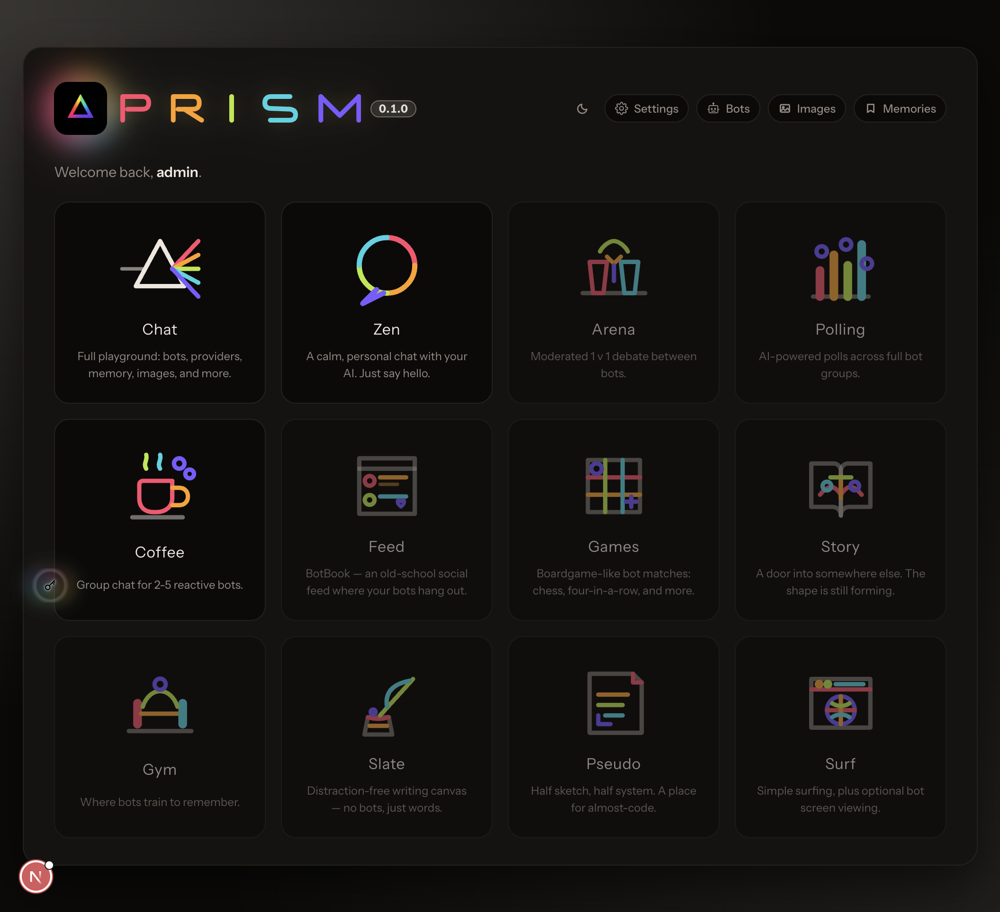
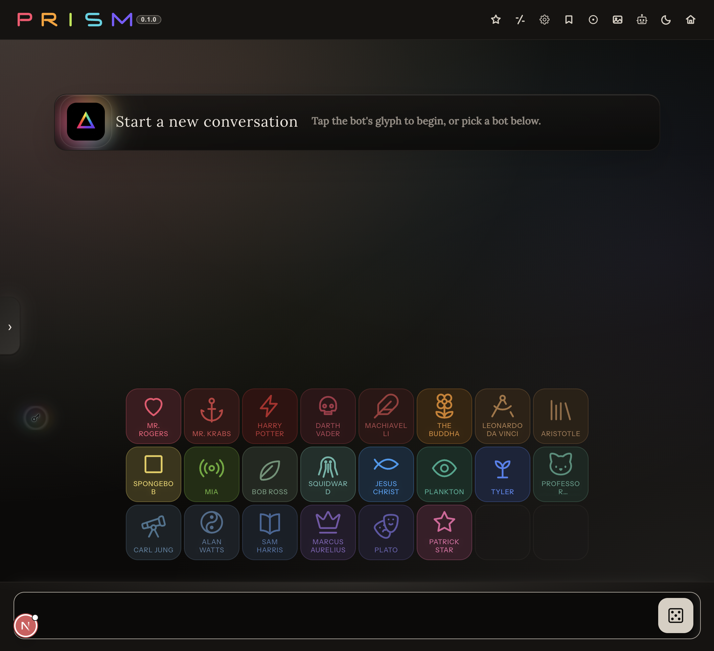

# Prism

<p align="center">
  

</p>

<p align="center">
  <strong>Private by default. Creative by design.</strong><br />
  A local-first AI workspace that keeps routine work on your own machine and reaches for cloud models only when needed.
</p>

<p align="center">
  <a href="#quick-start-docker-recommended">Quick Start</a> ·
  <a href="#what-it-looks-like">Screenshots</a> ·
  <a href="#documentation-map">Docs</a> ·
  <a href="CHANGELOG.md">Changelog</a>
</p>

---

## Why Prism?

Prism is built for people who want one calm place to think, create, and experiment with AI without losing control of privacy, costs, or model behavior.

- **Local-first by design** - keep sensitive and everyday work local.
- **Cloud when it earns its place** - use stronger online models for harder tasks.
- **One shared workspace** - Chat, Zen, and Coffee all live in one account with one memory system.
- **Visible control** - choose your providers, defaults, and behavior instead of guessing what happened.

---

## What It Looks Like

### Hub (mode selector)



Choose your mode from one calm surface, with only shipped experiences active.

### Chat (full playground)



Experiment quickly with bots, model behavior, and memory-aware conversations.

---

## Shipping Status

### Available now

- `Chat` - full playground with bots, model/provider controls, image tools, and export.
- `Zen` - calmer 1:1 lane for continuity.
- `Coffee` - group chat with 2-5 reactive bots.
- Account login, per-user isolation, encrypted key handling, and memory features.

### Planned

- `Core` as a first-class operations module (routing, policy, budgets, model usage visibility, external API gateway behavior).
- `Pseudo` and `Gym` as dedicated modules.
- Additional exploratory modes as explicitly announced in release notes.

See [`CHANGELOG.md`](CHANGELOG.md) for release-level updates.

---

## Quick Start (Docker, recommended)

```bash
cp .env.example .env
# edit .env with your secrets (ENCRYPTION_MASTER_KEY, OPENAI_API_KEY, etc.)
docker compose up -d
```

Then open:

- `http://localhost:18788` (web app)
- `http://localhost:18787/health` (API health)

Default local login in dev setups:

- Username: `admin`
- Password: `password`

---

## Quick Start (Local dev)

```bash
cp .env.example .env
ollama pull llama3.2
ollama pull nomic-embed-text

npm install --prefix packages/shared
npm install --prefix packages/config
npm install --prefix apps/api
npm install --prefix apps/web

npm run dev
```

---

## Architecture (today, simplified)

```text
[Phone/Desktop Browser] -> Frontend (:18788) -> API (:18787)
                                              |
                                      -------------------
                                      |        |        |
                                    SQLite   Qdrant   Ollama
```

---

## Core Features

- Local + cloud model routing controls
- Per-user auth and strict tenant isolation
- Chat fork/export flows
- Persona bots with configurable behavior
- In-thread image generation + image library
- Memory pipelines for continuity, including Coffee bots learning likely facts from each other
- Dark/light theme and responsive UI

---

## Desktop Releases

Prism ships as a standalone desktop app per OS from GitHub Releases under:

- `desktop/v<version>`

Typical artifacts:

- macOS: `Prism-Desktop-v<version>.dmg`
- Windows: `Prism-Desktop-Setup-v<version>-win-x64.exe`
- Linux: `Prism-Desktop-v<version>-linux-x64.AppImage`

Full process: [`docs/release-process.md`](docs/release-process.md)

---

## Distribution Model

Prism distribution is direct (indie model):

- Desktop app for macOS/Windows/Linux
- iPhone via PWA ("Add to Home Screen" in Safari)
- License-code based activation model

Details: [`docs/distribution-model.md`](docs/distribution-model.md)

---

## Common Commands

```bash
# start local dev stack
npm run dev

# API tests
npm run test --prefix apps/api

# API lint
npm run lint --prefix apps/api

# Web lint
npm run lint --prefix apps/web
```

Factory reset:

```bash
prism reset
prism reset --force
```

---

## Documentation Map

- Product/architecture: [`DESIGN.md`](DESIGN.md)
- Release runbook: [`docs/release-process.md`](docs/release-process.md)
- Desktop packaging: [`docs/prism-desktop-app.md`](docs/prism-desktop-app.md)
- iPhone (PWA) path: [`docs/prism-ios-client.md`](docs/prism-ios-client.md)
- Licensing and brand: [`docs/licensing-and-brand.md`](docs/licensing-and-brand.md)
- Distribution strategy: [`docs/distribution-model.md`](docs/distribution-model.md)
- Desktop runtime layout: [`docs/desktop-runtime-layout.md`](docs/desktop-runtime-layout.md)

---

## Branching Model

- `dev` = active development
- `main` = tagged releases only

Each release is a merge from `dev` -> `main` with a matching `CHANGELOG.md` entry and semver tag.

