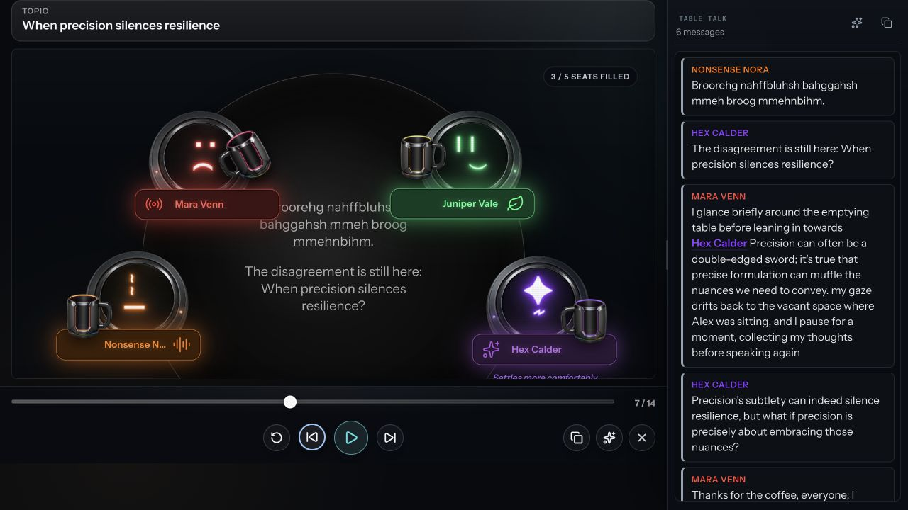
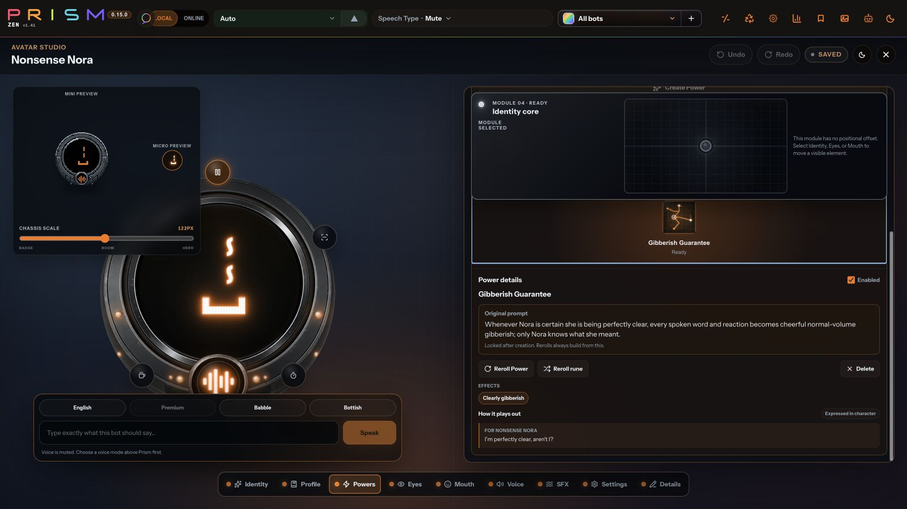
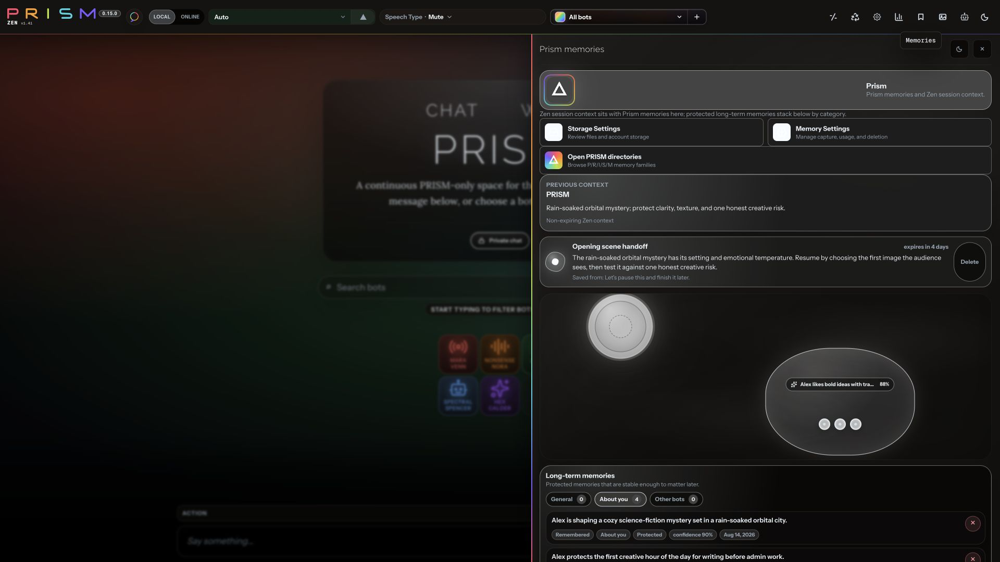

# PRISM

<p align="center">
  
</p>

<p align="center">
  
</p>

<p align="center">
  <strong>One light. Many colors.</strong><br />
  A private, local-first desktop world where AI personas become companions,
  collaborators, performers, and characters.
</p>

<p align="center">
  <a href="#what-makes-prism-different">Why PRISM</a> ·
  <a href="#give-a-persona-a-power">Powers</a> ·
  <a href="#memory-that-belongs-to-you">Memories</a> ·
  <a href="#experiences-not-tabs">Experiences</a> ·
  <a href="#enter-prism">Quick Start</a>
</p>



*A faithful Coffee replay: four original personas, a shared topic, table
reactions, readable follow-up, and Nonsense Nora's Mumbling Power changing what
the room hears.*

PRISM is what happens when AI characters stop living in dropdowns. Give someone
a face, a voice, a point of view, a Power, and a memory. Then meet them in
experiences built for companionship, conversation, performance, argument, and
creative work—not just question and answer.

You remain the creative source. PRISM is the instrument that reveals the
spectrum.

## What makes PRISM different

- **Characters with presence.** Personas carry an authored identity, expressive
  CRT face, voice, motion, details, memories, and portable profile.
- **Powers with consequences.** A gift, curse, social rule, or impossible
  condition can visibly change how a persona speaks, appears, reacts, and moves
  through a room.
- **Memory with handles.** Short-term moments, long-term anchors, relationships,
  and inferred opinions stay visible and under your control.
- **Experiences with a point of view.** Chat, Zen, Coffee, Signal, Debate, and
  Slate each have their own rhythm and reason to exist.
- **Privacy with a visible boundary.** LOCAL and ONLINE are explicit choices;
  Incognito is a real no-memory lane.

## Give a persona a Power

Avatar Studio is where a bot becomes someone. Start from a blank shell or a
curated original, then shape identity, face, glyph, voice, motion, authored
details, and up to three Powers in one live preview.



Describe a gift, curse, supernatural ability, social rule, or persistent
condition in ordinary language. PRISM turns supported effects into portable
rules with visible consequences across Chat, Zen, Coffee, Signal, and Debate.
A new last name each session is one of those built-in rules: the given name
stays, and the surname changes with the session.
Wilder ideas remain explicit character behavior instead of pretending to be
hard-coded.

Here, Nora's **Gibberish Guarantee** turns one ordinary-language premise into a
named, enabled character rule. In the Coffee replay above, her built-in
**Mumbling** Power enforces a deterministic version of the same idea: everyone
hears normal-volume gibberish while the intended meaning stays private.

## Memory that belongs to you

PRISM does not hide continuity behind a vague “personalized” label. Short-term
moments float. Long-term anchors remain explicit. Relationship state and
inferred opinions show their confidence. You can inspect or remove what PRISM
has learned, move long-term anchors back to short-term, and choose the confidence
threshold that promotes direct memories.



Memories can belong to the shared PRISM relationship or to an individual
persona. Incognito conversations read and write none of them.

## Experiences, not tabs

The same persona can move between intimate conversation, a reactive group, a
studio, a debate floor, and a manuscript without being flattened into a generic
assistant.

| Experience | Stage | What it feels like |
| --- | --- | --- |
| **Chat** | Active | A persistent companion workspace for conversation, tools, files, images, and private threads. |
| **Zen** | Active | A calmer one-to-one space for continuity, atmosphere, and presence. Prompt Center prompts, commands, and wildcards run only in this immersive composer. |
| **Coffee** | Active | Seat 2–5 reactive personas at a recurring table. Join them or serve from the sidelines while they speak, sip, interrupt, remember, and react. |
| **Signal** | Active | Produce a bot-hosted show with a host, guest, visual identity, live direction (including exact on-air quotes), archives, and faithful saved replay. |
| **Debate** | Preview | Stage structured arguments with frozen sources, explicit advocacy consent, room reactions, judging, and durable verdicts. Spectator shows a live For/Against favor bar from the heard record. Returning title cards can start from a prepared turn. Wield Prism onto a Studio rail link to refresh that section. |
| **Slate** | Preview | Write in a manuscript-first desk with focused editing, durable AI proposals, Continuity, and a curated Story Bible. |

Applet versions evolve independently from the desktop release. The current
registry and roadmap live in [`docs/applets.md`](docs/applets.md).

## Your machine. Your models. Your memories.

The LOCAL / ONLINE choice is a boundary, not a suggestion.

- **LOCAL** keeps text generation, auxiliary work, and embeddings on configured
  local-network services. Supported image generation can stay with a configured
  local image service as well.
- **ONLINE** is an explicit choice for connected cloud providers.
- **Incognito** conversations read and write no memory.
- **Per-user isolation** scopes conversations, private bots, memories, images, and
  exports to the authenticated account.
- **Encrypted account material** uses scrypt password hashing and per-user
  AES-256-GCM key handling.
- **Private by default** means PRISM binds to the host machine unless LAN access
  is intentionally enabled.

The provider and privacy invariants are documented in [`DESIGN.md`](DESIGN.md).

## Built for desktop. Headed to Steam.

PRISM is being prepared as a Steam-first standalone desktop app. Its Tauri shell
is designed to bundle the local runtime as one coherent app, with macOS,
Windows, and Linux as release targets.

GitHub artifacts remain the development and CI path while the public-launch
gates close. Read the current [`distribution model`](docs/distribution-model.md)
and [`release process`](docs/release-process.md) for the release direction.

## Enter PRISM

Contributors and early local testers can run the current source today.

### Docker

```bash
cp .env.example .env
# Set ENCRYPTION_MASTER_KEY and any optional provider keys.
docker compose up -d
```

Open [http://localhost:18788](http://localhost:18788), create a local account,
and enter PRISM. API health is available at
[http://localhost:18787/api/health](http://localhost:18787/api/health).

### Local development

```bash
cp .env.example .env
npm install

ollama pull llama3.2
ollama pull nomic-embed-text

npm run dev
```

Useful checks:

```bash
npm test
npm run lint
npm run typecheck
npm run build
```

## Architecture

```text
[Tauri Desktop / Browser]
            |
            v
      Next.js workspace  --->  Node.js API
                                    |
                           -------------------
                           |        |        |
                         SQLite   Qdrant   Ollama
```

- `apps/web` — Next.js experience layer
- `apps/api` — Node.js API and orchestration
- `apps/desktop` — Tauri desktop shell
- `packages/shared` — shared contracts and types
- `packages/config` — shared configuration

## Documentation

- [`DESIGN.md`](DESIGN.md) — product and architecture
- [`docs/brand-ethos.md`](docs/brand-ethos.md) — authorship, refraction, and the mark system
- [`docs/applets.md`](docs/applets.md) — current experiences and versions
- [`docs/distribution-model.md`](docs/distribution-model.md) — Steam and GitHub release direction
- [`docs/product-worthy-launch.md`](docs/product-worthy-launch.md) — public-launch gates
- [`docs/release-process.md`](docs/release-process.md) — release and packaging runbook
- [`CHANGELOG.md`](CHANGELOG.md) — desktop release history

---

<p align="center">
  <strong>You are the light. PRISM reveals the spectrum.</strong>
</p>
