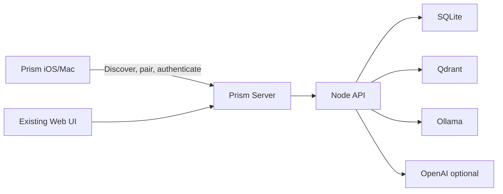

# Prism App Store Distribution

Prism's Apple distribution model is a two-binary product:

- **Prism Server**: the open-source local runtime that runs on Mac, Windows, or
  Linux.
- **Prism iOS/Mac**: the official paid native companion client distributed
  through the App Store.

The server owns the user's data and AI runtime. The native app connects to that
server, stores a device session, and provides the polished Apple-platform
experience.

## Product Split

## Prism Server

Prism Server is the canonical runtime. It should be installable from GitHub
Releases and run on a user-owned desktop/server machine.

Responsibilities:

- Start, stop, and report status for the Prism stack.
- Own SQLite, Qdrant, provider settings, encryption keys, and account data.
- Provide a managed first-run setup that hides implementation details like
  Qdrant behind user-facing concepts such as "Memory Engine."
- Expose the API to trusted local clients.
- Advertise itself on the LAN for native app discovery.
- Display QR/pairing codes for new clients.
- Keep the existing web app available as the desktop/admin UI.
- Explain clearly that user data lives on the user's server.

Initial packaging stance:

- GitHub source remains public for auditability and community contribution.
- GitHub Releases provide server downloads and release notes.
- A signed/notarized desktop launcher is preferred before pursuing Mac App
  Store server distribution.
- The macOS desktop app now lives in `apps/server-mac/`; see
  `docs/prism-server-app.md` for local builds, managed first-run setup, signing,
  notarization, and DMG release steps.
- Prism Server.app should not require Docker for the Mac-first experience.
  Ollama should remain native for local acceleration; Qdrant should become a
  Prism-managed sidecar unless the user explicitly points Prism at an existing
  Qdrant endpoint.
- Mac App Store distribution for the server is deferred because sandboxing,
  self-contained bundle rules, Node packaging, Qdrant, and Ollama need a
  separate feasibility pass.

## Prism iOS/Mac

Prism iOS/Mac is the official paid frontend. It should be native enough to
justify App Store distribution and should not depend on a `WKWebView` as the
primary experience.

Responsibilities:

- First-run onboarding for users with no local device session.
- Local Network permission request with clear purpose text.
- Bonjour/mDNS scan for Prism Server instances.
- Tap/click-to-connect server selection.
- Manual host entry for custom hosts, remote servers, VPNs, or discovery
  failure.
- QR/pairing-code exchange with Prism Server.
- Keychain-backed bearer session storage.
- Native chat, conversation list, basic settings, and bot selection.
- Face ID/Touch ID app lock where available.

MVP non-goals:

- Running models on-device.
- Rebuilding the full Sandbox/customizer surface.
- Replacing the existing web UI for desktop administration.
- Blocking community clients at the protocol layer.

## First-Run Client Onboarding

The native client should guide the user through connecting to a server rather
than presenting an account form first.

Recommended flow:

1. **Welcome**: explain that Prism needs a Prism Server on the user's computer
   or home server.
2. **Find Server**: request Local Network permission and scan for
   `_prism._tcp.` services.
3. **Choose Server**: show discovered servers by friendly name and host.
4. **Fallback**: allow manual URL entry if discovery fails.
5. **Pair**: scan QR code or enter a pairing code shown by Prism Server.
6. **Secure Session**: store the returned session in the Keychain.
7. **Open Prism**: land in the conversation list or new-chat screen.

If no server is found, the app should explain how to download Prism Server from
GitHub Releases and include a non-intrusive link to the public repository or
setup page.

## App Store Review Posture

The iOS/Mac app should be submitted as a companion client for a required
user-controlled server.

Submission checklist:

- App metadata states that Prism Server is required.
- Notes for Review include a live demo server or full demo mode.
- Review notes explain local-network discovery, manual host entry, pairing, and
  why Local Network permission is requested.
- Privacy copy distinguishes data stored on-device from data stored on the
  user's server.
- The app includes native UI, Keychain storage, biometric lock, and Apple
  platform conventions so it is not a repackaged website.
- All external provider behavior is represented honestly: LOCAL routes through
  the configured local provider, ONLINE may call OpenAI if configured by the
  server/user.

## Licensing And Commercial Model

Prism should be transparent about what is open and what is paid.

Recommended split:

- **Prism Server**: true open-source license. AGPLv3 is the default candidate if
  strong reciprocity is desired for networked modifications.
- **Official Prism iOS/Mac**: proprietary paid App Store app.
- **Prism name, logo, icon, and App Store assets**: protected by trademark and
  brand guidelines.
- **Community clients**: not blocked at the protocol layer, but they cannot
  present themselves as official Prism or use protected branding.

Avoid DRM-style server checks that only allow the official frontend. In a
local-first open server, those checks are brittle, hostile to trust, and easy to
patch out. The durable moat should be polish, App Store convenience, support,
brand trust, and a great official client.

## README Placement

The root README should eventually carry two prominent links:

- Download Prism Server from GitHub Releases.
- Get the official Prism iOS/Mac client from the App Store.

Until the App Store app exists, the README should describe this as the planned
distribution model and link to this document plus the mobile API contract.
