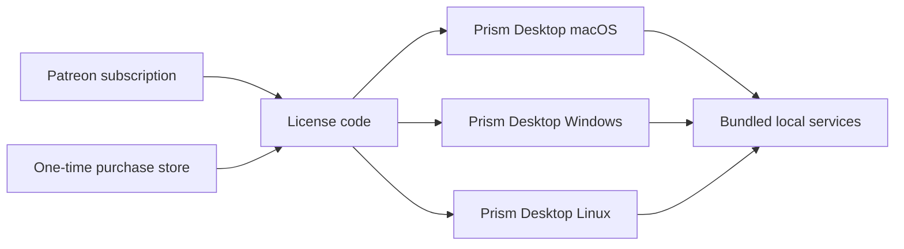

# Prism Distribution Model

Prism is moving to a **single desktop app per operating system** model.
Customers install one packaged app that already includes Prism's local services
(API, data layer, memory engine wiring, and desktop shell).

For what Prism is as a product, see [`README.md`](../README.md). This file is
the canonical source for pricing/distribution posture. If any build/release doc
disagrees, this file wins.

## Current Product Direction

- Desktop distribution is direct: no App Store, no Mac App Store, no
  TestFlight, no Microsoft Store requirement.
- GitHub Releases remains the binary delivery channel.
- Steam (and similar stores) is a planned publish lane for the same desktop
  artifacts.
- iPhone remains a separate PWA path served by Prism; no native iOS binary.

## What Users Buy

Users purchase access to **Prism Desktop** (not a separate "client app" and
"server app" pair).

The desktop app includes:
- UI shell
- local API runtime
- local data and memory plumbing
- first-run setup helpers for local AI dependencies (for example Ollama/model pulls)

Users should not need to manually install or launch a separate Prism Server to
use Prism Desktop.

## Per-Platform Delivery (Target State)

| Platform | Format | Channel | Signing |
|---|---|---|---|
| macOS | `Prism-Desktop-v<version>.dmg` | GitHub Releases (and future Steam lane) | Developer ID + notarized |
| Windows | `Prism-Desktop-Setup-v<version>-win-x64.exe` and optional portable ZIP | GitHub Releases (and future Steam lane) | Standard code-signing certificate when available |
| Linux | `Prism-Desktop-v<version>-linux-x64.tar.gz` (AppImage follow-up) | GitHub Releases (and future Steam lane) | Unsigned initially |
| iPhone | PWA via Safari -> Add to Home Screen | Served by Prism desktop-hosted/local Prism service | Not applicable |

## Licensing Model (JetBrains-style)

Two purchase paths, one entitlement concept.

### One-time purchase

- Pays once, receives a license code.
- Unlocks the purchased Prism Desktop version across supported desktop
  platforms owned by the user.
- Future versions require either another one-time purchase or a subscription.

### Subscription (Patreon)

- Pays monthly, receives (or keeps) a license code.
- Unlocks always-current Prism Desktop builds while active.
- On cancellation, user keeps the last entitled version.

### License posture

- License verification stays lightweight and honest-user friendly.
- No aggressive DRM, hardware fingerprinting, or always-online lock-in.
- Piracy resistance relies primarily on product quality, support, and iteration
  speed.

## Update Mechanics

- Desktop app checks for newer releases and prompts users when entitled.
- iPhone PWA updates follow whichever Prism version the paired host is running.
- Internal local services are updated with the desktop app package.

## Transitional Compatibility

The old split "Prism Server" plus "Prism Client" release lanes are now
**transitional scaffolding** for engineering migration only.

During migration:
- Existing server wrappers and runtime packaging scripts can still be reused.
- Public messaging and operator runbooks should treat **Prism Desktop** as the
  customer-facing product.

## Open Questions

- Final one-time purchase storefront choice (Gumroad, LemonSqueezy, Stripe, or
  equivalent).
- Full entitlement issuance/validation backend implementation details.
- Final Linux packaging format priority (tarball first vs AppImage-first).
- Final Windows signing certificate tier (standard vs EV).

## Historical Note

App Store/TestFlight-era docs are archival only:
- [app-store-distribution.md](app-store-distribution.md)
- [app-store-review.md](app-store-review.md)
