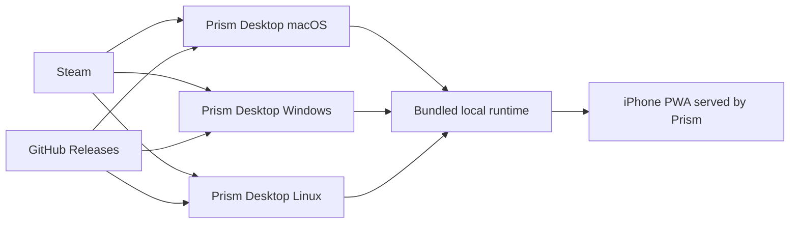

# Prism Distribution Model

Prism ships as a **single standalone desktop app per operating system**.
Users install one app that already contains Prism's local runtime components.

For what Prism is as a product, see [`README.md`](../README.md). If any build
or release doc disagrees with this file, this file wins.

## Product Direction

- Desktop distribution is direct: no App Store, no Mac App Store, no TestFlight.
- Steam is the desktop release target.
- GitHub Releases is the direct-download path while Steam is being prepared.
- Official desktop builds are free to download and use.
- iPhone remains a separate PWA path served by Prism.

## What Users Get

Users download **Prism Desktop** directly.

Each desktop build includes:

- UI shell
- local API runtime
- local data and memory plumbing
- first-run dependency helpers, such as Ollama/model pulls

Users should not install or run a separate server app for the normal desktop
experience.

## Per-Platform Delivery

| Platform | Format | Release Tag | Signing |
|---|---|---|---|
| macOS | Steam-ready `PRISM.app` zip + direct-download DMG | Steam branch + `desktop/v<version>` | Developer ID + notarized |
| Windows | Steam-ready portable zip + direct-download setup EXE (+ optional MSI) | Steam branch + `desktop/v<version>` | Standard code-signing certificate when available |
| Linux | Steam depot + direct-download AppImage | Steam branch + `desktop/v<version>` | Unsigned initially |
| iPhone | PWA via Safari -> Add to Home Screen | N/A | Not applicable |

## Channel Model

Prism's active public channels are Steam and GitHub Releases.

- Steam is the launch target for desktop discovery and installs.
- GitHub Releases remains the direct-download path for now and a practical
  fallback channel.
- No paid feature locks, activation checks, purchase screens, or runtime
  entitlement checks are part of this phase.
- Store-specific copy should describe Prism as the same free local-first
  desktop app, with channel differences limited to installer/update mechanics.

## Launch Readiness

Do not broadly promote Prism until the product-worthy checklist is satisfied:

- Mac, Windows, and Linux installers are smoke-tested.
- First-run setup is understandable for non-developers.
- Steam and GitHub Releases explain the download path clearly.
- LOCAL mode and privacy guarantees are verified.
- Steam store presence and build review are completed before public Steam
  release.

The detailed launch checklist lives in
[`product-worthy-launch.md`](product-worthy-launch.md).

## Legal And Brand Posture

This repository currently should not make final source-license claims until a
real `LICENSE`, trademark notice, contributor policy, and brand-use policy are
present. Public copy can say that official builds are free to download and use,
and that source availability/licensing details are pending.

## Historical Note

Legacy split server/client and paid-access docs are archival only and are
non-canonical.
