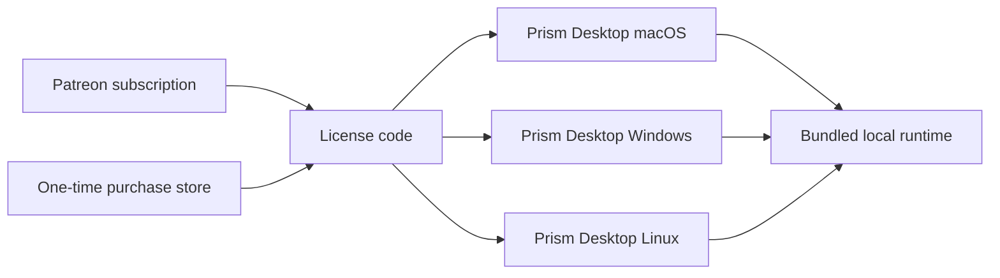

# Prism Distribution Model

Prism ships as a **single standalone desktop app per operating system**.
Users install one app that already contains Prism's local runtime components.

For what Prism is as a product, see [`README.md`](../README.md). If any build
or release doc disagrees with this file, this file wins.

## Product Direction

- Desktop distribution is direct: no App Store, no Mac App Store, no TestFlight.
- GitHub Releases is the primary delivery channel.
- Steam (and similar stores) is an additional lane for the same desktop artifacts.
- iPhone remains a separate PWA path served by Prism.

## What Users Buy

Users buy access to **Prism Desktop**.

Each desktop build includes:
- UI shell
- local API runtime
- local data and memory plumbing
- first-run dependency helpers (for example Ollama/model pulls)

Users should not install or run a separate server app.

## Per-Platform Delivery

| Platform | Format | Release Tag | Signing |
|---|---|---|---|
| macOS | `Prism-Desktop-v<version>.dmg` | `desktop/v<version>` | Developer ID + notarized |
| Windows | `Prism-Desktop-Setup-v<version>-win-x64.exe` (+ optional MSI) | `desktop/v<version>` | Standard code-signing certificate when available |
| Linux | `Prism-Desktop-v<version>-linux-x64.AppImage` | `desktop/v<version>` | Unsigned initially |
| iPhone | PWA via Safari -> Add to Home Screen | N/A | Not applicable |

## Licensing Model (JetBrains-style)

Two purchase paths, one entitlement concept.

### One-time purchase

- Pays once, receives a license code.
- Unlocks the purchased Prism Desktop version across supported desktop platforms.
- Future versions require another one-time purchase or a subscription.

### Subscription (Patreon)

- Pays monthly, receives (or keeps) a license code.
- Unlocks always-current Prism Desktop builds while active.
- On cancellation, user keeps the last entitled version.

### License posture

- Lightweight verification and honest-user friendly behavior.
- No aggressive DRM, hardware fingerprinting, or always-online lock-in.
- Piracy resistance relies primarily on product quality and support.

## Historical Note

Legacy split server/client docs are archival only and are non-canonical.
