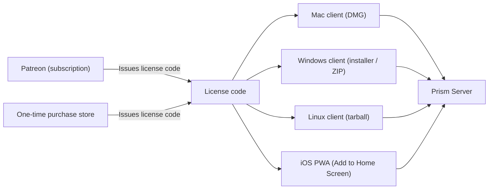

# Prism Distribution Model

Prism is shipped as an indie product: direct downloads, no app stores, no
TestFlight. The server is open source. The clients are paid, gated by a license
code that hooks into the existing pairing/passkey system.

This document is the canonical positioning and licensing reference. Operator
and platform-specific docs (release process, per-app build docs) defer to this
file when their guidance disagrees.

## Distribution Posture

- **No App Store**, no Mac App Store, no Microsoft Store, no Google Play, no
  TestFlight.
- **GitHub Releases** is the single source of truth for downloadable client and
  server binaries.
- **Patreon** is the canonical subscription channel.
- **A separate one-time purchase store** (Gumroad, Lemonsqueezy, or
  equivalent — choice deferred) handles single-purchase licenses.
- **iOS** is delivered as a Progressive Web App (PWA) served by Prism Server.
  Users open the server URL in Safari and "Add to Home Screen" for a
  springboard shortcut that launches in kiosk mode. There is no native iOS
  binary in this distribution model.

## Per-Platform Delivery

| Platform | Client format | Channel | Signing |
|---|---|---|---|
| macOS | `Prism-v<version>.dmg` | GitHub Releases | Developer ID + notarized |
| Windows | `Prism-Setup-v<version>-win-x64.exe` and `Prism-v<version>-win-x64-portable.zip` | GitHub Releases | Standard code-signing certificate (when available) |
| Linux | `Prism-v<version>-linux-x64.tar.gz` (or AppImage in a follow-up) | GitHub Releases | Unsigned, ships as-is |
| iOS | PWA via `https://<server-host>/` -> Safari -> Add to Home Screen | Served by Prism Server | Not applicable |

The server runs on macOS, Windows, and Linux with the existing release lanes
(see [release-process.md](release-process.md)). The server is free and open
source; it does not consume a license code.

## Licensing Model (JetBrains-style)

Two purchase paths, one shared license-code primitive.

### One-time purchase

- Pays once, gets a license code.
- The code activates the **current version** of the Prism client on **all four
  platforms** (Mac DMG, Windows installer/ZIP, Linux tarball, iOS PWA) for
  perpetual personal use of that version.
- **No free updates** to future versions. The user can keep using the version
  they bought as long as they want, but a new version requires either a new
  one-time purchase or upgrading to the subscription.

### Monthly subscription (Patreon)

- Pays each month, gets (or keeps) a license code.
- The code activates the **always-current** Prism client on **all four
  platforms**.
- **Updates are included** for as long as the subscription is active.
- If the subscription is cancelled, the user keeps perpetual access to the
  **last version** that was current while their subscription was active. They
  do not lose what they already had; they simply stop receiving new versions.

### What the license code unlocks

The license code is what lets a client app talk to a Prism Server. Without it,
the pairing flow rejects the client. This means:

- Server-side users (Mac/Windows/Linux server) can run the open-source server
  freely; the gate is on the **client** side.
- iOS PWA users still pair with the server using a license code; the
  "Add to Home Screen" flow does not bypass the gate.
- Cross-platform: one license code works on every platform the user owns.
  Switching from Mac to Windows is "log in with the same code," not "buy
  again."

### Anti-piracy posture

- License codes plug into the **existing pairing/passkey system** on the
  server. No new crypto and no separate license daemon are introduced by this
  model; the same primitive that already proves "this client is allowed to
  pair with this server" also proves "this client has a paid license."
- Prism does **not** ship aggressive DRM, hardware fingerprinting, or
  always-on activation pings. The durable moat is polish, support, and the
  community — not adversarial protection.
- Stolen or shared codes are an acceptable cost; the licensing model is
  optimized for honest users, not for fighting piracy.

## Update Mechanics

- **Mac, Windows, Linux clients**: each launch performs a lightweight version
  check against GitHub Releases. If a newer version exists and the user's
  license entitles them to it (subscriber, or one-time purchaser still on
  their entitled version), the app shows an in-app update prompt with a
  download link. One-time purchasers viewing a newer release see an
  "Upgrade to subscribe" path instead.
- **iOS PWA**: updates are automatic. Because the PWA is served by Prism
  Server, the user gets whatever version the server is hosting. There is no
  per-version PWA license check; the license check is on the **server** at
  pairing time.
- **Server** (open source): downloaded from GitHub Releases. No license check.
  Users are encouraged to keep the server reasonably current to match the
  newest clients, but old server / old client combinations are supported on a
  best-effort basis within the same major version.

## Operator Quick Map

When you cut a release under this model, the rough flow is:

1. Tag and build the **server** binaries (Mac DMG, Windows installer + ZIP,
   Linux tarball). See [release-process.md](release-process.md).
2. Tag and build the **client** binaries (Mac DMG, Windows installer + ZIP,
   Linux tarball when scaffolded). Sign and notarize where applicable.
3. **Publish** the GitHub Release (no draft step required for indie
   distribution; the publish gate is operator judgment, not App Review).
4. **Post the download links to Patreon** in a patron-only post and include
   the freshly issued license codes for any new patrons.
5. **iOS PWA** needs no separate release step. Users get the new web shell as
   soon as the server they paired with is updated.

## Open Questions

These are unresolved decisions; this doc will be updated as they land.

- **One-time purchase platform**: Gumroad, Lemonsqueezy, Itch.io, or direct
  Stripe? Pricing not yet decided.
- **License-code generation and validation server**: not yet built. The
  existing pairing system is the integration point but the issuance pipeline
  (Patreon webhook -> code generated -> emailed to patron) is a separate
  implementation effort.
- **DMG visual polish for the Mac client**: the current DMG layout is
  utilitarian (Prism.app + an `Applications` symlink, default Finder layout).
  Background image, positioned icons, and a drag-here cue are deferred until
  after the first real signed-and-notarized release proves the pipeline.
- **Windows client**: deferred. Today's distribution model assumes Mac, iOS
  (via PWA), and eventually Windows + Linux desktop clients. Windows desktop
  is a future scaffold, not a current ship target.
- **Code signing certificate for Windows**: standard ($100-$200/year) vs EV
  ($300+/year, hardware token). Decision deferred until a Windows client
  exists.

## Relationship To Older Docs

The following docs are now historical and superseded by this one:

- [docs/app-store-distribution.md](app-store-distribution.md) (App Store path,
  no longer the active plan)
- [docs/app-store-review.md](app-store-review.md) (App Store review checklist,
  retained for archive only)

The native iOS client at `apps/ios-client/` is **deprecated** in this model.
The shipping iPhone experience is the PWA. The Xcode project is retained for
archive but is no longer the distribution path; see
[prism-ios-client.md](prism-ios-client.md) for the deprecation banner and PWA
guidance.
