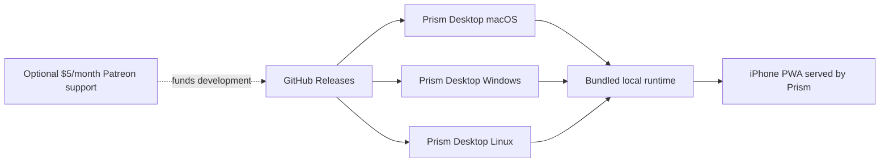

# Prism Distribution Model

Prism ships as a **single standalone desktop app per operating system**.
Users install one app that already contains Prism's local runtime components.

For what Prism is as a product, see [`README.md`](../README.md). If any build
or release doc disagrees with this file, this file wins.

## Product Direction

- Desktop distribution is direct: no App Store, no Mac App Store, no TestFlight.
- GitHub Releases is the primary delivery channel.
- Official desktop builds are free to download and use.
- Optional support is a single $5/month Patreon lane.
- Support is not a product tier and does not unlock core features.
- Steam and similar stores may become additional lanes for the same official
  desktop artifacts, but the GitHub release remains the baseline free download.
- iPhone remains a separate PWA path served by Prism.

## What Users Get

Users download **Prism Desktop** directly.

Each desktop build includes:

- UI shell
- local API runtime
- local data and memory plumbing
- first-run dependency helpers, such as Ollama/model pulls

Users should not install or run a separate server app for the normal desktop
experience.

## Per-Platform Delivery

| Platform | Format | Release Tag | Signing |
|---|---|---|---|
| macOS | `Prism-Desktop-v<version>.dmg` | `desktop/v<version>` | Developer ID + notarized |
| Windows | `Prism-Desktop-Setup-v<version>-win-x64.exe` (+ optional MSI) | `desktop/v<version>` | Standard code-signing certificate when available |
| Linux | `Prism-Desktop-v<version>-linux-x64.AppImage` | `desktop/v<version>` | Unsigned initially |
| iPhone | PWA via Safari -> Add to Home Screen | N/A | Not applicable |

## Support Model

Prism's first commercial model is optional support, not access control.

- One Patreon support option: `$5/month`.
- No tiers, paid feature locks, purchase screens, or supporter-only core
  functionality.
- No Patreon account linking in the product for this phase.
- No telemetry or outbound support checks from the local runtime.
- A future in-app entry point should be quiet: a Settings/About link labeled
  `Support Prism` that opens Patreon externally.

The product should remain usable, private, and clear for people who never
support financially. The support ask should feel like helping the project
continue, not like buying permission to use Prism.

## Launch Readiness

Do not broadly promote Prism until the product-worthy checklist is satisfied:

- Mac, Windows, and Linux installers are smoke-tested.
- First-run setup is understandable for non-developers.
- GitHub Releases and the README explain the free download path clearly.
- LOCAL mode and privacy guarantees are verified.
- Support copy is ready, restrained, and non-intrusive.

The detailed launch checklist lives in
[`product-worthy-launch.md`](product-worthy-launch.md).

## Legal And Brand Posture

This repository currently should not make final source-license claims until a
real `LICENSE`, trademark notice, contributor policy, and brand-use policy are
present. Public copy can say that official builds are free to download and use,
and that source availability/licensing details are pending.

## Historical Note

Legacy split server/client and paid-access docs are archival only and are
non-canonical.
