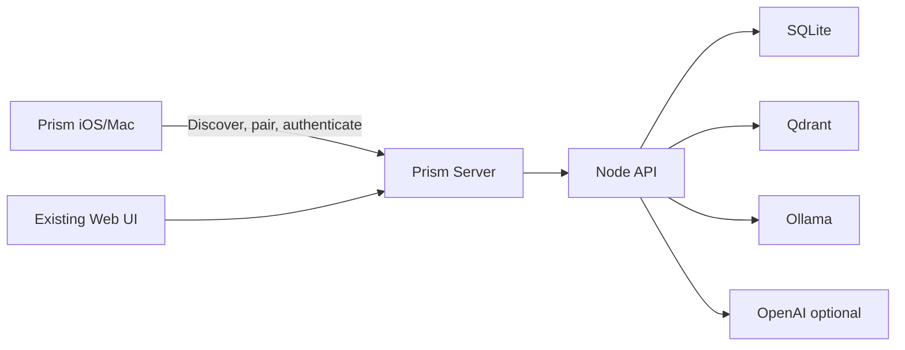

# docs/app-store-distribution.md

## AI Summary
<!-- kb:summary:start -->
_Pending Ollama summary._
<!-- kb:summary:end -->

## Linked notes
- [[04-docs/docs/prism-server-app.md]]

## Referenced by
- [[04-docs/DESIGN.md]]
- [[04-docs/README.md]]

## Source path
- `docs/app-store-distribution.md`

## Body preview
```markdown
# Prism App Store Distribution

Prism's Apple distribution model is a two-binary product:

- **Prism Server**: the open-source local runtime that runs on Mac, Windows, or
  Linux.
- **Prism iOS/Mac**: the official paid native companion client distributed
  through the App Store.

The server owns the user's data and AI runtime. The native app connects to that
server, stores a device session, and provides the polished Apple-platform
experience.

## Product Split



## Prism Server

Prism Server is the canonical runtime. It should be installable from GitHub
Releases and run on a user-owned desktop/server machine.

Responsibilities:

- Start, stop, and report status for the Prism stack.
- Own SQLite, Qdrant, provider settings, encryption keys, and account data.
- Provide a managed first-run setup that hides implementation details like
  Qdrant behind user-facing concepts such as "Memory Engine."
- Expose the API to trusted local clients.
- Advertise itself on the LAN for native app discovery.
- Display QR/pairing codes for new clients.
- Keep the existing web app available as the desktop/admin UI.
- Explain clearly that user data lives on the user's server.

Initial packaging stance:

- GitHub source remains public for auditability and community contribution.
- GitHub Releases provide server downloads and release notes.
- A signed/notarized desktop launcher is preferred before pursuing Mac App
  Store server distribution.
- The macOS desktop app now lives in `apps/server-mac/`; see
  `docs/prism-server-app.md` for local builds, managed first-run setup, signing,
  notarization, and DMG release steps.
- Prism Server.app should not require Docker for the Mac-first experience.
  Ollama should remain native for local acceleration; Qdrant should become a
  Prism-managed sidecar unless the user explicitly points Prism at an existing
  Qdrant endpoint.
- Mac Ap

... (truncated)
```

## Related (semantic)
<!-- kb:related:start -->
_Pending semantic related links._
<!-- kb:related:end -->
